<div align=center>

<p></p>
<p></p>
<font size=5>
In the Name of God
<font/>
<p></p>
 <br/>
    <br/>
    <br/>
<font color=#FF7500>
<div align=center>
Final Project
</font>
<p></p>
<font color=blue>
Stochastic Processes / Prof. ‪Hamid R. Rabiee / Sharif University of Technology
</font>
<br/>
<br/>
Sepehr Ghobadi
<br/>
400211008
<br/>
Fall 2021

</div>
</div>


```python
import numpy as np
from datetime import datetime
import matplotlib.pyplot as plt
from utils import logsumexp, draw_trans_graph, set_logger
import time, logging, jdc
```

# Project Aims and Objectives

In this project we investigate solutions to three fundamental problems' for HMM design, namely: the evaluation of the probability of a sequence of observations given a specific HMM; the determination of a best sequence of model states (decoding observations); and the adjustment of model parameters so as to best account for the observed signal, in context of a real-world problem example. we also study a simple application of sampling methods on this problem.


Consider a police, they constantly moving between the neighbourhoods to maintain security in the city. Map of the streets and places where the police is patrolling is as follows:


```python
city_map = np.load('./city_map.npy')
draw_trans_graph(city_map-np.diag(np.ones(city_map.shape[0])))
```


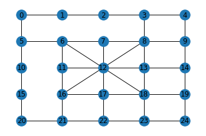


when he reaches a place, with certain probabilities travels to a connected neighbourhood or decides to stay in current place. also in each point on the map like $S_i$ there are $N_{s_i} \in \{1,2,...10\}$ heat sensors which with high probability they sense presence of police, but sometimes some of them (with low probabilities) dont work and only $M_i  \in \{0,1,...,N_{s_i}\}$ of them recognize the police. any sequence of observations in this problem is the number of sensors that recognized the police for all states that he moved along. i.e. for an unknown sequence of states like $\{s_{x1}, s_{x2}, ..., s_{xT}\}$ which is polices trajectory, we have an observation like $\{o_{1}, o_{2}, ..., o_{T}\}$ where each $o_t$ is equal to $N_{xt}$ with high probability and less than that sometimes. for each state probabilities of defection of sensors are constant.

first we model the problem with a Markov Chain and using training observations will find the parameters(start state, transition and emission probabilities) of markov chain by implementing unsupervised Baum-Welch EM algorithm. then using learned parameters we evaluate some test observations with Forward/Backward algorithms. finally we decode test observations by Viterbi decoding algorithm.


```python
train_data = np.load('./train_data.npy')
test_data = np.load('./test_data.npy')
print("Train Data: Shape:{}".format(train_data.shape), "\nTest Data: shape{}\nSample Observation:\n".format(test_data.shape), test_data[-1], '\nMarkov Chain Graph:')
n_states, n_obs = 25, 11
draw_trans_graph(city_map)
```

    Train Data: Shape:(500, 500)
    Test Data: shape(100, 50)
    Sample Observation:
     [ 4  6  4  6  7  6  7  7  5  4  0  9  4  9  3  9  3  2  3  3  2  4  6  7
      5  9  4  2  4  2  0  2  8  3  8  7  8  7  9  2  1  2  9  2  1 10  2  4
      6  4]
    Markov Chain Graph:


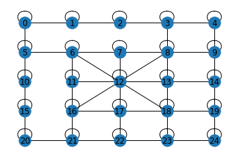


# Hidden Markov Models

To fully specify a hidden Markov model, you need five parameters:

1. N (n_states), the number of states in the model. We denote the set of all possible states as $S = \{S_1,S_2,··· ,S_N\}$, the state at time t as $x_t$.

2. M (n_obs), the number of distinct observation symbols per state, i.e., the discrete alphabet size of the output set. We denote the set of all possible output symbols as $V = \{v_1,v_2,··· ,v_M\}$, the output symbol at time t as $O_t$. The sequence of observed symbols is denoted as $O = O_1,O_2,···,O_T$.

3. The state transition probability distribution $T = \{t_{ij}\}$, where $t_{ij} = P[x_{t+1} = S_j|x_t = S_i], 1 ≤ i,j ≤ N$.

4. The observation symbol probability distribution in state j, $E = \{e_{j(k)}\}$, where $e_{j(k)} = p[O_t = v_k|x_t = S_j], 1 ≤ j ≤ N,1 ≤ k ≤ M$.

5. The initial state distributions $\pi = \{\pi_i\}$, where $\pi_i = P[x_1 = S_i], 1 ≤ i ≤ N$.

A compact representation of a model is $\lambda = (A,E,\pi)$, where N,M are implicitly implied by T and E.


```python
class HMM(object):
    def __init__(self, n_states, n_obs, implementation="scale"):
        self.n_states = n_states
        self.n_obs = n_obs
        self.implementation = implementation
        # n_x is size of X space

    def init_params(self, state_priors=None, trans_prob=None, emit_prob=None):
        self.state_priors = (1/self.n_states)*np.ones(self.n_states) if state_priors is None else state_priors
        self.trans_prob = (1/self.n_states)*np.ones((self.n_states,self.n_states)) if trans_prob is None else trans_prob
        self.emit_prob = (1/self.n_obs)*np.ones((self.n_states,self.n_obs)) if emit_prob is None else emit_prob
        return self

    def get_log_params(self):
        return np.log(self.state_priors).copy(), np.log(self.trans_prob).copy(), np.log(self.emit_prob).copy()

    def get_params(self):
        return self.state_priors.copy(), self.trans_prob.copy(), self.emit_prob.copy()

    def update_params(self, state_priors, trans_prob, emit_prob):
        self.trans_prob = trans_prob
        self.emit_prob = emit_prob
        self.state_priors = state_priors
```

## 1. Evaluation

first problem to consider in HMMs is the evaluation problem, namely given a
model and a sequence of observations, how do we compute the probability that the observed sequence was produced by the model. We can also view the problem as one of scoring how well a given model matches a given observation sequence. The latter viewpoint is extremely useful. For example, if we consider the case in which we are trying to choose among several competing models, the solution to Problem 1 allows us to choose the model which best matches the observations.

Trying to find probability of observations $O=o_1,o_2,...,o_T$ by means of considering all hidden state sequences is impractical because we have $N^M$ hidden state sequences and brute-force solution has exponential complexity. instead we use methods of dynamic programming for evaluation.


### 1.1. Forward recursion for HMM

the forward algorithm takes advantage of the conditional independence rules of the hidden Markov model to perform the calculation recursively.
to demonstrate the recursion, let:

$$\alpha_t(x_t) = p(x_t,o_{1:t}) = \sum_{x_{t-1}}p(x_t,x_{t-1},o_{1:t})$$.

Using the Chain rule to expand $p(x_t,x_{t-1},o_{1:t})$, we can then write

$$\alpha_t(x_t) = \sum_{x_{t-1}}p(o_t|x_t,x_{t-1},o_{1:t-1})p(x_t|x_{t-1},o_{1:t-1})p(x_{t-1},o_{1:t-1}).$$

Because $o_t$ is conditionally independent of everything but $x_t$, and $x_t$ is conditionally independent of everything but $x_{t-1}$, this simplifies to

$$\alpha_t(x_t) = p(o_t|x_t)\sum_{x_{t-1}}p(x_t|x_{t-1})\alpha_{t-1}(x_{t-1}).$$

Thus, since $p(o_t|x_t)$ and $p(x_t|x_{t-1})$ are given by the model's emission distributions and transition probabilities, one can quickly calculate $\alpha_t(x_t)$ from $\alpha_{t-1}(x_{t-1})$ and avoid incurring exponential computation time.

$$\alpha_t(x_t) = p(o_t|x_t)\sum_{x_{t-1}}p(x_t|x_{t-1})\alpha_{t-1}(x_{t-1}) = e_{o_t}(x_t)\sum_{x_{t-1}}T_{x_t,x_{t-1}}\alpha_{t-1}(x_{t-1}).$$
$$ \Rightarrow P(o_1,o_2,...,o_T) = \sum_{i} P(o_1, o_2, ..., o_T, x_t=S_i) = \sum_{i} \alpha_{T}(S_i) $$

### 1.2. Backward recursion for HMM

similar to forward we can define backward variables and evaluate by backward recursion:

Let $\beta_i(t)=P(o_{t+1},\ldots,o_T\mid x_t=S_i)$ that is the probability of the ending partial sequence $o_{t+1},\ldots,o_T$ given starting state $i$ at time $t$. We calculate $\beta_i(t)$ as,

$$\beta_i(T)=1,$$

$$\beta_i(t)= P(o_{t+1},\ldots,o_T\mid x_t=S_i) = \sum_{j}P(o_{t+1},\ldots,o_T, x_{t+1}=S_j\mid x_t=S_i) = $$
$$= \sum_{j}P(o_{t+1},\ldots,o_T, \mid x_{t+1}=S_j, x_t=S_i)P(x_{t+1}=S_j \mid x_t=S_i) =$$ $$= \sum_{j}P(o_{t+2},\ldots,o_T, \mid x_{t+1}=S_j)P(o_{t+1}\mid x_{t+1}=S_j)P(x_{t+1}=S_j \mid x_t=S_i) = \sum_{j=1}^N \beta_j(t+1) T_{ij} e_j(o_{t+1}).$$
$$ \Rightarrow P(o_1,o_2,...,o_T) = \sum_{i} P(o_1, o_2, ..., o_T\mid x_1=S_i)P(x_1=S_i) = \sum_{i} \beta_{1}(i)e_{j}(o_1)\pi(i) $$


### 1.3. Scaling

since these recursive equations contain recursive multiplying of probabilities, for long sequences values of forward and backward variables $\alpha$ & $\beta$ will vanish to zero. also because of existence of sum operator in recursive equations we cant use only logarithm for smoothing this vanishing effect. with logsumexp operator since we should convert to exp format to sum, the algorithm will numerically underflow for longer sequences too.

The solution is that at each induction step of the forward algorithm, we need to scale all $\alpha_t(i)$’s appropriately. This scaling factor should only depend on the current time index t, but be independent of the state i. A commonly used scaling scheme for computing forward variables is:
- Initialization:
$$ \ddot{\alpha}_1(i) = \alpha(i)$$
$$ c_1 = \frac{1}{\sum_{i=1}^{N} \ddot{\alpha}_1(i)} \Rightarrow \hat{\alpha}_1(i) = c_1 \ddot{\alpha}_1(i)$$
- Induction:
$$ \ddot{\alpha}_t(i) = \sum_{j=1}^{N} \hat{\alpha}_{t-1}(j) T_{ji} e_i(o_t)$$
$$ c_t = \frac{1}{\sum_{i=1}^{N} \ddot{\alpha}_t(i)} \Rightarrow \hat{\alpha}_t(i) = c_t \ddot{\alpha}_t(i)$$

The coefficient $c_t$ is the scaling factor at each step, and $c_t$ only depends on the time index t, not i. Also, the summation of modified forward variable is always 1, i.e.,$\sum_{i=1}^{N} \hat{\alpha}_t(i)=1$. By induction, we can easily prove that:
$$ \hat{\alpha}_t(i) = ( \prod_{\tau=1}^{t} c_{\tau} ) \alpha_t(i)$$

If we use this modified forward algorithm to do the evaluation problem, at the last step,we have:
$$ 1 = \sum_{i=1}^{N} \hat{\alpha}_T(i) = \sum_{i=1}^{N} ( \prod_{\tau=1}^{T} c_{\tau} ) \alpha_T(i) = $$
$$ =  ( \prod_{\tau=1}^{T} c_{\tau} )\sum_{i=1}^{N} \alpha_T(i) = ( \prod_{\tau=1}^{T} c_{\tau} )P(o_1, ..., o_T) $$
$$ \Rightarrow log[P(o_1, ..., o_T)] = -\sum_{\tau=1}^{T} log c_{\tau}$$

For backward variables, we use the same scale factors for each time t for β’s as were used for α’s. Since each scale factor effectively restores the magnitude of the $\alpha$ terms to 1, and since the magnitudes of the $\alpha$ and
$\beta$ terms are comparable, using the same scaling factors on the $\beta$'s as was used on the $\alpha$'s is an effective way of keeping the computation within reasonable bounds. also we see other benefits in Baum-Welch algorithm. More formally:

- Initialization:
$$ \ddot{\beta}_T(i) = 1$$
$$ \hat{\beta}_T(i) = c_1T\ddot{\beta}_T(i)$$
- Induction:
$$ \ddot{\beta}_t(i) = \sum_{j=1}^N \hat{\beta}_j(t+1) T_{ij} e_j(o_{t+1})$$
$$ \hat{\beta}_t(i) = c_t \ddot{\beta}_t(i)$$
We can also by induction prove that:
$$ \hat{\beta}_t(i) = ( \prod_{\tau=t}^{T} c_{\tau} ) \beta_t(i)$$


```python
%%add_to HMM

def forward_eval(self, observation):
    return {'scale':self.forward_eval_scale, 'log':self.forward_eval_log}[self.implementation](observation)
def backward_eval(self, observation, scales):
    return {'scale':self.backward_eval_scale, 'log':self.backward_eval_log}[self.implementation](observation, scales)

def forward_eval_scale(self, observation):
    seq_length = observation.shape[0]
    alpha, scales = np.zeros((seq_length, self.n_states)), np.ones(seq_length)

    alpha[0] = self.state_priors * np.array(self.emit_prob)[:,observation[0]]
    scales[0] = 1./np.sum(alpha[0])
    alpha[0] *= scales[0]
    for k in range(1,seq_length):
        alpha[k][:] = np.sum(np.array([alpha[k-1]]).T*self.trans_prob, axis=0) * np.array(self.emit_prob)[:,observation[k]]
        scales[k] = 1./np.sum(alpha[k][:])
        alpha[k][:] *= scales[k]
    log_likelihood = -np.sum(np.log(scales)) # in unscaled version np.sum(alpha[-1][:])

    return log_likelihood, alpha, scales

def backward_eval_scale(self, observation, scales):
    seq_length = observation.shape[0]
    beta = np.ones((seq_length, self.n_states))
    beta[seq_length-1] *= scales[seq_length-1]
    for k in reversed(range(seq_length-1)):
        beta[k] = np.sum(beta[k+1]*self.trans_prob*np.array(self.emit_prob)[:,observation[k+1]], axis=1)
        beta[k] *= scales[k]
    return beta


def forward_eval_log(self, observation):
    seq_length = observation.shape[0]
    log_trans_prob = np.log(self.trans_prob).copy()
    log_emit_prob = np.log(np.array(self.emit_prob)).copy()

    log_alpha = np.zeros((seq_length, self.n_states))
    log_alpha[0] = np.log(self.state_priors) + log_emit_prob[:,observation[0]]
    for k in range(1,seq_length):
        log_alpha[k] = logsumexp(np.array([log_alpha[k-1]]).T + log_trans_prob, axis=1) + log_emit_prob[:,observation[k]]
    return logsumexp(log_alpha[-1]), log_alpha

def backward_eval_log(self, observation, scales): #scales is useless
    seq_length = observation.shape[0]
    log_trans_prob, log_emit_prob = np.log(self.trans_prob).copy(), np.log(np.array(self.emit_prob)).copy()

    log_beta = np.zeros((seq_length, self.n_states)) #log 1 = 0 (first row is 1 in bckwrd init)
    for k in reversed(range(seq_length-1)):
        log_beta[k] = logsumexp(log_beta[k+1]+log_trans_prob+log_emit_prob[:,observation[k+1]], axis=1)

    return log_beta
```

# 2. Decoding: Viterbi Algorithm

The algorithm for solving the state-tracking problem (the second one of the three HMM problems) looks very similar except that the summation symbol at each step should be replaced by a ‘max’ operation. To find the single best state sequence, $Q = \{q_l, q_2, ..., q_T\}$, for the given observation sequence $O = \{o_1, o_2, ..., o_T\}$ which maximizes $P(Q \mid o_1, o_2, ..., o_T)$, or equivalently $P(Q, o_1, o_2, ..., o_T)$, we need to define the quantity $\delta$ as:
$$ \delta_t(i) = \underset{x_1,x_2,...,x_{t-1}}{\mathrm{max}} P(x_1,...,x_{t-1},x_t=S_i \mid o_1,...,o_T) $$

general idea in viterbi algorithm is that if best path ending in $x_k=S_j$ goes through $x_{k-1}=S_i$ then it     should coincide with best path ending in $x_{k-1}=S_i$ (Divide and Conquere Soundness Condition). so we have:

$$ \delta_{t+1}(j) = \underset{x_1,x_2,...,x_{t}}{\mathrm{max}} P(x_1,...,x_{t},x_{t+1}=S_j \mid o_1,...,o_T) = $$
$$ =\underset{i}{\mathrm{max}}[ \underset{x_1,x_2,...,x_{t-1}}{\mathrm{max}} P(x_1,...,x_{t-1},x_{t}=S_i \mid o_1,...,o_T) T_{ij} e_j(o_{t+1}) ]$$
$$ =\underset{i}{\mathrm{max}}[ \delta_t(i) T_{ij} e_j(o_{t+1}) ]$$

alongside calculating $\delta$ we can store the argmax indices wich maximize $\delta_t(i)$ as parent of (t,i). so starting from $\underset{i}{\mathrm{max}} \delta_T(i)$ we can find the best i for last state, backtrack to its parent (par[T][i]) and recursivly find best states for each timestep. also since there is no sequential sum or product of probabilities we can use sum of logarithms to prevent underflow in each step.


```python
%%add_to HMM

def decode_viterbi(self, observation):
    seq_length = observation.shape[0]
    log_trans_prob, log_emit_prob, log_state_priors = np.ma.log(self.trans_prob).filled(np.NINF) \
                                                    , np.ma.log(self.emit_prob).filled(np.NINF) \
                                                    , np.ma.log(self.state_priors).filled(np.NINF)

    delta, par = np.zeros((seq_length, self.n_states)), np.zeros((seq_length, self.n_states), dtype="int64")
    delta[0][:] = [log_state_priors[i]+log_emit_prob[i][observation[0]] for i in range(self.n_states)]
    for k in range(1,seq_length):
        for j in range(self.n_states):
            recursions = [delta[k-1][i]+log_trans_prob[i][j] for i in range(self.n_states)]
            par[k][j] = np.argmax(recursions)
            delta[k][j] = recursions[par[k][j]]+log_emit_prob[j][observation[k]]
    best_state, states_seq = np.argmax(delta[seq_length-1][:]), []
    for k in reversed(range(seq_length)):
        states_seq.append(best_state)
        best_state = par[k][best_state]
    return states_seq[::-1]

```

# 3. Learning: Baum-Welch Algorithm

From forward and backward variables, it’s straightforward to calculate some other useful variables easily. The first one is the probability of being in state $S_i$ at time t, given the observation sequence O, denoted using $\gamma_t(i)$. using Bayes theorem we have:

$$ \gamma_t(i) = P(x_t = S_i \mid O) = \frac{P(x_t = S_i , O)}{P(O)} = \frac{\alpha_t(i)\beta_t(i)}{P(O)}$$

The second one is $\zeta_t(i,j)$, the probability of being in state $S_i$ at time t, and state $S_j$ at time t+1, given the observation sequence, i.e.,

$$ \zeta_t(i,j) = P(x_t=S_i, x_{t+1}=S_j \mid O) =  \frac{P(x_t=S_i, x_{t+1}=S_j, O}{P(O)} = \frac{\alpha_t(i)T_{ij}e_j(O_{t+1})\beta_{t+1}(j)}{P(O)}$$

They satisfy the relationship:

$$ \gamma_t(i) = \sum_{j=1}^{N} \zeta_t(i,j) $$

It is not difficult to figure out how forward and backward variables are used here to compute $\gamma_t(i)$ and $\zeta_t(i,j)$. Note that $\gamma_t(i)$ and $\zeta_t(i,j)$ are both conditioned on the observation sequence O, which looks very friendly and promising, since that’s exactly what a learning problem embraces: given the observation sequence, we try learn what the best parameters are. Baum-Welch algorithm simply uses these two variables to iteratively update the model until it converges to our satisfaction.

the Baum–Welch algorithm is a special case of the Expectation-Maximization algorithm used to find the unknown parameters of a hidden Markov model. One key point to understand Baum-Welch algorithm, is to comprehend two interpretations. If we sum $\gamma_t(i)$ over the time index t from 1 to T − 1, we get a quantity $\sum_{t=1}^{T-1} \gamma_t(i)$, which can be interpreted as the expected number of times that state $S_i$ is visited, or the expected number of transitions made from state $S_i$ given the model parameters and the observation sequence O. Similarly, summation of $\zeta_t(i,j)$ over t from 1 to T −1 , i.e., $\sum_{t=1}^{T-1} \zeta_t(i,j)$, can be interpreted as the expected number of transitions from state $S_i$ to state $S_j$ given the model parameters and the observation sequence O. Then, the Baum-Welch algorithm adjusts model parameters using these expected numbers:
- $\bar{\pi}_i = \gamma_1(i)$
- $\bar{T}_{ij} = \frac{\sum_{t=1}^{T-1}\zeta_t(i,j)}{\sum_{t=1}^{T-1} \gamma_t(i)}$
- $\bar{e}_{j}(k) = \frac{\sum_{t=1, O_t=v_k}^{T} \gamma_t(j)}{\sum_{t=1}^{T} \gamma_t(j)}$

following EM algorithm, after the update, we obtain a set of new model parameters $(\bar{T},\bar{E},\bar{\pi})$. We repeat the same process again and again until changes in parameters are smaller than a predefined threshold.

## 3.1. Baum-Welch with Scaling

using results we found in scaling section, we can use modified backward\forward variables for a numericallly-stable training and also interestingly easier calculations! Recalling two scaling eqations we have:

$$\hat{\alpha}_t(i) = ( \prod_{\tau=1}^{t} c_{\tau} ) \alpha_t(i) = C_t \alpha_t(i) $$
$$\hat{\beta}_t(i) = ( \prod_{\tau=t}^{T} c_{\tau} ) \beta_t(i) = D_t \beta_t(i)$$

where we use $C_t$ to denote $\prod_{\tau=1}^{t} c_{\tau}$ and $D_t$ to denote $\prod_{\tau=t}^{T} c_{\tau}$.

Now let’s consider how Baum-Welch algorithm should be changed using the modified forward and backward variables:

$$ \bar{T}_{ij} = \frac{ \sum_{t=1}^{T-1} \zeta_t(i,j)}{\sum_{t=1}^{T-1} \gamma_t(i)} $$

$$ =  \frac{\sum_{t=1}^{T-1}\alpha_t(i)T_{ij}e_j(O_{t+1})\beta_{t+1}(j)}{\sum_{t=1}^{T-1}\alpha_t(i)\beta_t(i)}$$

$$ =  \frac{\sum_{t=1}^{T-1}\frac{\hat{\alpha}_t(i)}{C_t} T_{ij}e_j(O_{t+1})\frac{\hat{\beta}_{t+1}(j)}{D_{t+1}}}{\sum_{t=1}^{T-1}\frac{\hat{\alpha}_t(i)}{C_t} \frac{\hat{\beta}_t(i)}{D_t}}$$

$$ =  \frac{\sum_{t=1}^{T-1}\hat{\alpha}_t(i)T_{ij}e_j(O_{t+1})\hat{\beta}_{t+1}(j)}{\sum_{t=1}^{T-1}\frac{\hat{\alpha}_t(i)\hat{\beta}_t(i)}{c_t}}$$

Note that here we use the relationship $C_t·D_{t+1}=\prod_{i=1}^{N}c_i = C_T$, and $C_t·D_t=\prod_{i=1}^{t}c_i.\prod_{i=t}^{N}c_i = C_t.c_t$ . Similarly, we have:

$$\bar{e}_{j}(k) = \frac{\sum_{t=1, O_t=v_k}^{T} \gamma_t(j)}{\sum_{t=1}^{T-1} \gamma_t(j)} = $$

$$ = \frac{\sum_{t=1, O_t=v_k}^{T}\frac{\hat{\alpha}_t(j)\hat{\beta}_t(j)}{c_t} }{\sum_{t=1}^{T-1} \frac{\hat{\alpha}_t(j)\hat{\beta}_t(j)}{c_t}} $$

## 3.2. Multiple Sequences of Observations

To have sufficient data to train the model, we have to observe for multiple times, obtaining multiple sequences of output symbols. How should the Baum-Welch algorithm be modified?The idea stays the same: sum up the expected number of transitions of interest and calculate ratios to replace model parameters. Suppose we have L sequences of observed symbols, indexed by l. The observation length is denoted using $T_l$. The observation sequences are denoted using $\mathcal{O}=[O_1,O_2,···,O_L]$. The new learning problem becomes to adjust the parameters of the model $\lambda$ to maximize

$$ P(\mathcal{O}|\lambda) = \prod_{\mathcal{l}=1}^{L} P(O^l \mid \lambda) = \prod_{\mathcal{l}=1}^{L} \mathcal{P}_{\mathcal{l}}$$

where $\mathcal{P}_{\mathcal{l}}$ represents for $P(O^l|λ)$, which can be calculated using the forward algorithm as an evaluation problem. $\gamma$ and $\zeta$ now have new meanings and slightly different forms:

$$ \gamma^{\mathcal{l}}_t(i) = P(x_{t}^{\mathcal{l}} = S_i \mid \mathcal{O}) = P(x_{t}^{\mathcal{l}} = S_i \mid O^{\mathcal{l}}) = \frac{\alpha_{t}^{\mathcal{l}}(i)\beta_{t}^{\mathcal{l}}(i)}{\mathcal{P}_{\mathcal{l}}}$$
similarly:
$$ \zeta^{\mathcal{l}}_t(i,j) = \frac{\alpha_{t}^{\mathcal{l}}(i)T_{ij}e_j(O_{t+1})\beta_{t+1}^{\mathcal{l}}(j)}{\mathcal{P}_{\mathcal{l}}}$$

Nothing has been significantly changed from the one-observation sequence case. Note the following remarks:
- For each observation sequence, we need to calculate a different set of forward and backward variables, which is why we put a subscript l on the shoulders of $\alpha$’s and $\beta$’s.
- The definitions of $\gamma_{t}^{\mathcal{l}}(i)$’s and $\zeta_{t}^{\mathcal{l}}(i,j)$’s are conditioned on all observed sequences.
- In the Baum-Welch algorithm for the single observation case, we simply ignore the term $\mathcal{P}_{\mathcal{l}}$ since it will be canceled out when we take the ratio. However, as we will show later, this term has to be maintained in the calculation since we can’t cancel them out any more by taking the ratio. They are different for different observation sequences.


Summarizing results of scaling and multiple observation ideas, the modified Baum-Welch algorithm can be listed as:

$$ \bar{T}_{ij} = \frac{\sum_{\mathcal{l}=1}^{L} \sum_{t=1}^{T_\mathcal{l}-1} \zeta_{t}^{\mathcal{l}}(i,j)}{\sum_{\mathcal{l}=1}^{L} \sum_{t=1}^{T_\mathcal{l}-1} \gamma_{t}^{\mathcal{l}}(i)} $$

$$ =  \frac{\sum_{\mathcal{l}=1}^{L} \sum_{t=1}^{T_\mathcal{l}-1}\alpha_{t}^{\mathcal{l}}(i)T_{ij}e_j(O_{t+1})\beta_{t+1}^{\mathcal{l}}(j) / \mathcal{P}_{\mathcal{l}}}{\sum_{\mathcal{l}=1}^{L} \sum_{t=1}^{T_\mathcal{l}-1}\alpha_{t}^{\mathcal{l}}(i)\beta_{t}^{\mathcal{l}}(i) / \mathcal{P}_{\mathcal{l}}}$$

$$ =  \frac{\sum_{\mathcal{l}=1}^{L} \sum_{t=1}^{T_\mathcal{l}-1}\hat{\alpha}_{t}^{\mathcal{l}}(i)T_{ij}e_j(O_{t+1})\hat{\beta}_{t+1}^{\mathcal{l}}(j) / (\mathcal{P}_{\mathcal{l}} C_{T}^{\mathcal{l}})}{\sum_{\mathcal{l}=1}^{L} \sum_{t=1}^{T_\mathcal{l}-1}\hat{\alpha}_{t}^{\mathcal{l}}(i)\hat{\beta}_{t}^{\mathcal{l}}(i) / (c_{t}^{\mathcal{l}} \mathcal{P}_{\mathcal{l}} C_{T}^{\mathcal{l}})}$$

$$ \mathcal{P}_{\mathcal{l}} C_{T}^{\mathcal{l}} = 1 \Rightarrow   \bar{T}_{ij} = \frac{\sum_{\mathcal{l}=1}^{L} \sum_{t=1}^{T_\mathcal{l}-1}\hat{\alpha}_{t}^{\mathcal{l}}(i)T_{ij}e_j(O_{t+1})\hat{\beta}_{t+1}^{\mathcal{l}}(j)}{\sum_{\mathcal{l}=1}^{L} \sum_{t=1}^{T_\mathcal{l}-1}\hat{\alpha}_{t}^{\mathcal{l}}(i)\hat{\beta}_{t}^{\mathcal{l}}(i) / c_{t}^{\mathcal{l}}} $$

with similar calcualtions we have:

$$\bar{e}_{j}(k) = \frac{\sum_{\mathcal{l}=1}^{L} \sum_{t=1, O_t=v_k}^{T_\mathcal{l}} \gamma_{t}^{\mathcal{l}}(j)}{\sum_{\mathcal{l}=1}^{L} \sum_{t=1}^{T_\mathcal{l}} \gamma_{t}^{\mathcal{l}}(j)}$$

$$ = \frac{\sum_{\mathcal{l}=1}^{L} \sum_{t=1, O_{t}^{\mathcal{l}}=v_k}^{T}\alpha_{t}^{\mathcal{l}}(j)\beta_{t}^{\mathcal{l}}(j)/\mathcal{P}_{\mathcal{l}} }{\sum_{\mathcal{l}=1}^{L} \sum_{t=1}^{T-1} \alpha_{t}^{\mathcal{l}}(j)\beta_{t}^{\mathcal{l}}(j)/c_t}  $$

$$ = \frac{\sum_{\mathcal{l}=1}^{L} \sum_{t=1, O_{t}^{\mathcal{l}}=v_k}^{T}\hat{\alpha}_{t}^{\mathcal{l}}(j)\hat{\beta}_{t}^{\mathcal{l}}(j)/c_{t}^{\mathcal{l}} }{\sum_{\mathcal{l}=1}^{L} \sum_{t=1}^{T-1} \hat{\alpha}_{t}^{\mathcal{l}}(j)\hat{\beta}_{t}^{\mathcal{l}}(j)/c_{t}^{\mathcal{l}}}  $$

$$\bar{\pi}_i = \frac{\sum_{\mathcal{l}=1}^{L} \sum_{i=1}^{N} \gamma_{i}^{\mathcal{l}}(1)}{L}$$

By using scaling, we find that all $\mathcal{P}_{\mathcal{l}}$’s terms are cancelled out! The resulting format looks much cleaner


```python
class BW():
    def __init__(self, n_states, n_obs, implementation="scale", state_priors=None, trans_prob=None, emit_prob=None):
        self.n_states = n_states
        self.n_obs = n_obs
        self.implementation = implementation
        self.model = HMM(self.n_states, self.n_obs, implementation=self.implementation).init_params(state_priors, trans_prob, emit_prob)


    def calc_likelihood(self, observations):
        alphas, betas, scales = np.zeros((self.n_samples, self.seq_length, self.n_states)), np.zeros((self.n_samples, self.seq_length, self.n_states)), np.zeros((self.n_samples, self.seq_length))
        log_likelihood = 0
        for l in range(observations.shape[0]):
            log_p, alphas[l], scales[l] = self.model.forward_eval(observations[l])
            betas[l] = self.model.backward_eval(observations[l], scales[l])
            log_likelihood += log_p
        return alphas, betas, scales, log_likelihood

    def maximization(self, observations, alphas, betas, scales, log_likelihood):
        state_priors, trans_prob, emit_prob = self.model.get_params()
        new_trans_probb = np.zeros((self.n_states,self.n_states))
        new_emit_probb = np.zeros((self.n_states,self.n_obs))
        for i in range(self.n_states):
            for j in range(self.n_states):
                trans_num = (alphas[:,0:self.seq_length-1,i] * betas[:,1:self.seq_length,j]) * np.array([np.array(emit_prob[j])[observations[l,1:self.seq_length]] for l in range(self.n_samples)])
                trans_denum = np.multiply(alphas[:,0:self.seq_length-1,i], betas[:,0:self.seq_length-1,i])/scales[:,0:self.seq_length-1]
                new_trans_probb[i][j] = np.sum(trans_num)*trans_prob[i][j]/np.sum(trans_denum)
            for j in range(self.n_obs):
                emit_denum = (alphas[:,:,i] * betas[:,:,i])/scales
                emit_num = emit_denum * (observations == j).astype(int)
                new_emit_probb[i][j] = np.sum(emit_num)/np.sum(emit_denum)

        new_priors = np.sum(alphas[:,0,:]*betas[:,0,:]/self.n_samples, axis=0)
        new_priors = new_priors/np.sum(new_priors)

        self.model.update_params(new_priors.copy(), new_trans_probb.copy(), new_emit_probb.copy())

    def fit(self, observations, max_iter=500, ll_treshold=0.0001, logfile=False):
        self.n_samples, self.seq_length = observations.shape[0], observations.shape[1]
        set_logger('training_logs.log', logfile)
        alphas, betas, scales, likelihood_old = self.calc_likelihood(observations)
        for iteration in range(max_iter):
            logging.info("----------------------- iter: {} --------------------------".format(iteration+1))

            self.maximization(observations, alphas, betas, scales, likelihood_old)
            alphas, betas, scales, likelihood_new = self.calc_likelihood(observations)

            logging.info("old log ll: {}  --  new log ll: {}".format(likelihood_old, likelihood_new))

            if abs(likelihood_new-likelihood_old) < ll_treshold :
                break
            likelihood_old = likelihood_new
        return self.model

```

# 4. Testing


```python
start_trans_prob = city_map / np.sum(city_map, axis=1).reshape(-1,1)
start_emit_prob = np.array([[1/n_obs for _ in range(n_obs)] for i in range(n_states)])
start_state_prior = np.array([1/n_states for _ in range(n_states)])

bw_model = BW(n_states=n_states, n_obs=n_obs, implementation="scale", state_priors=start_state_prior.copy(), trans_prob=start_trans_prob.copy(), emit_prob=start_emit_prob.copy())
model_test = bw_model.fit(train_data, max_iter=100, logfile=False)

```

    ----------------------- iter: 1 --------------------------
    old log ll: -599473.8181995926  --  new log ll: -560232.4151503711
    ----------------------- iter: 2 --------------------------
    old log ll: -560232.4151503711  --  new log ll: -560231.7986993287
    ----------------------- iter: 3 --------------------------
    old log ll: -560231.7986993287  --  new log ll: -560225.7413374594
    ----------------------- iter: 4 --------------------------
    old log ll: -560225.7413374594  --  new log ll: -560159.171119957
    ----------------------- iter: 5 --------------------------
    old log ll: -560159.171119957  --  new log ll: -559373.8866081415
    ----------------------- iter: 6 --------------------------
    old log ll: -559373.8866081415  --  new log ll: -554315.9636980009
    ----------------------- iter: 7 --------------------------
    old log ll: -554315.9636980009  --  new log ll: -547112.117503443
    ----------------------- iter: 8 --------------------------
    old log ll: -547112.117503443  --  new log ll: -542789.7535878145
    ----------------------- iter: 9 --------------------------
    old log ll: -542789.7535878145  --  new log ll: -538058.0250283869
    ----------------------- iter: 10 --------------------------
    old log ll: -538058.0250283869  --  new log ll: -531992.7685178771
    ----------------------- iter: 11 --------------------------
    old log ll: -531992.7685178771  --  new log ll: -525291.9215192328
    ----------------------- iter: 12 --------------------------
    old log ll: -525291.9215192328  --  new log ll: -517739.1639192102
    ----------------------- iter: 13 --------------------------
    old log ll: -517739.1639192102  --  new log ll: -510602.2553607815
    ----------------------- iter: 14 --------------------------
    old log ll: -510602.2553607815  --  new log ll: -505566.4713284867
    ----------------------- iter: 15 --------------------------
    old log ll: -505566.4713284867  --  new log ll: -502079.28514956747
    ----------------------- iter: 16 --------------------------
    old log ll: -502079.28514956747  --  new log ll: -499075.0019290082
    ----------------------- iter: 17 --------------------------
    old log ll: -499075.0019290082  --  new log ll: -495618.10159798607
    ----------------------- iter: 18 --------------------------
    old log ll: -495618.10159798607  --  new log ll: -491403.4762990092
    ----------------------- iter: 19 --------------------------
    old log ll: -491403.4762990092  --  new log ll: -486605.72998161067
    ----------------------- iter: 20 --------------------------
    old log ll: -486605.72998161067  --  new log ll: -479631.2319388594
    ----------------------- iter: 21 --------------------------
    old log ll: -479631.2319388594  --  new log ll: -470258.7938122659
    ----------------------- iter: 22 --------------------------
    old log ll: -470258.7938122659  --  new log ll: -461113.32568325335
    ----------------------- iter: 23 --------------------------
    old log ll: -461113.32568325335  --  new log ll: -455324.3094088567
    ----------------------- iter: 24 --------------------------
    old log ll: -455324.3094088567  --  new log ll: -451834.44922240556
    ----------------------- iter: 25 --------------------------
    old log ll: -451834.44922240556  --  new log ll: -449249.8284107147
    ----------------------- iter: 26 --------------------------
    old log ll: -449249.8284107147  --  new log ll: -447109.0897309606
    ----------------------- iter: 27 --------------------------
    old log ll: -447109.0897309606  --  new log ll: -445236.5450672241
    ----------------------- iter: 28 --------------------------
    old log ll: -445236.5450672241  --  new log ll: -443564.1348249532
    ----------------------- iter: 29 --------------------------
    old log ll: -443564.1348249532  --  new log ll: -442099.81490821217
    ----------------------- iter: 30 --------------------------
    old log ll: -442099.81490821217  --  new log ll: -440869.5998806926
    ----------------------- iter: 31 --------------------------
    old log ll: -440869.5998806926  --  new log ll: -439874.64707836806
    ----------------------- iter: 32 --------------------------
    old log ll: -439874.64707836806  --  new log ll: -439087.325318366
    ----------------------- iter: 33 --------------------------
    old log ll: -439087.325318366  --  new log ll: -438464.8686237117
    ----------------------- iter: 34 --------------------------
    old log ll: -438464.8686237117  --  new log ll: -437966.04382297135
    ----------------------- iter: 35 --------------------------
    old log ll: -437966.04382297135  --  new log ll: -437559.1037343153
    ----------------------- iter: 36 --------------------------
    old log ll: -437559.1037343153  --  new log ll: -437220.0249403238
    ----------------------- iter: 37 --------------------------
    old log ll: -437220.0249403238  --  new log ll: -436929.05340321944
    ----------------------- iter: 38 --------------------------
    old log ll: -436929.05340321944  --  new log ll: -436669.2613958783
    ----------------------- iter: 39 --------------------------
    old log ll: -436669.2613958783  --  new log ll: -436426.2959846519
    ----------------------- iter: 40 --------------------------
    old log ll: -436426.2959846519  --  new log ll: -436187.9763399435
    ----------------------- iter: 41 --------------------------
    old log ll: -436187.9763399435  --  new log ll: -435943.8642881148
    ----------------------- iter: 42 --------------------------
    old log ll: -435943.8642881148  --  new log ll: -435685.64772076166
    ----------------------- iter: 43 --------------------------
    old log ll: -435685.64772076166  --  new log ll: -435408.0868847611
    ----------------------- iter: 44 --------------------------
    old log ll: -435408.0868847611  --  new log ll: -435109.7699217639
    ----------------------- iter: 45 --------------------------
    old log ll: -435109.7699217639  --  new log ll: -434791.12086028716
    ----------------------- iter: 46 --------------------------
    old log ll: -434791.12086028716  --  new log ll: -434449.98693363776
    ----------------------- iter: 47 --------------------------
    old log ll: -434449.98693363776  --  new log ll: -434076.65955452586
    ----------------------- iter: 48 --------------------------
    old log ll: -434076.65955452586  --  new log ll: -433657.4341610486
    ----------------------- iter: 49 --------------------------
    old log ll: -433657.4341610486  --  new log ll: -433191.05073511106
    ----------------------- iter: 50 --------------------------
    old log ll: -433191.05073511106  --  new log ll: -432667.5225986941
    ----------------------- iter: 51 --------------------------
    old log ll: -432667.5225986941  --  new log ll: -432053.65446258953
    ----------------------- iter: 52 --------------------------
    old log ll: -432053.65446258953  --  new log ll: -431356.18120667385
    ----------------------- iter: 53 --------------------------
    old log ll: -431356.18120667385  --  new log ll: -430678.32204541157
    ----------------------- iter: 54 --------------------------
    old log ll: -430678.32204541157  --  new log ll: -430137.9031378501
    ----------------------- iter: 55 --------------------------
    old log ll: -430137.9031378501  --  new log ll: -429744.933010212
    ----------------------- iter: 56 --------------------------
    old log ll: -429744.933010212  --  new log ll: -429469.23515618144
    ----------------------- iter: 57 --------------------------
    old log ll: -429469.23515618144  --  new log ll: -429281.567938237
    ----------------------- iter: 58 --------------------------
    old log ll: -429281.567938237  --  new log ll: -429152.3701298911
    ----------------------- iter: 59 --------------------------
    old log ll: -429152.3701298911  --  new log ll: -429059.6724259947
    ----------------------- iter: 60 --------------------------
    old log ll: -429059.6724259947  --  new log ll: -428990.4430491855
    ----------------------- iter: 61 --------------------------
    old log ll: -428990.4430491855  --  new log ll: -428937.3000815982
    ----------------------- iter: 62 --------------------------
    old log ll: -428937.3000815982  --  new log ll: -428895.72587884706
    ----------------------- iter: 63 --------------------------
    old log ll: -428895.72587884706  --  new log ll: -428862.70630681585
    ----------------------- iter: 64 --------------------------
    old log ll: -428862.70630681585  --  new log ll: -428836.0416533685
    ----------------------- iter: 65 --------------------------
    old log ll: -428836.0416533685  --  new log ll: -428814.0224715277
    ----------------------- iter: 66 --------------------------
    old log ll: -428814.0224715277  --  new log ll: -428795.3446184561
    ----------------------- iter: 67 --------------------------
    old log ll: -428795.3446184561  --  new log ll: -428779.06057299185
    ----------------------- iter: 68 --------------------------
    old log ll: -428779.06057299185  --  new log ll: -428764.4816655313
    ----------------------- iter: 69 --------------------------
    old log ll: -428764.4816655313  --  new log ll: -428751.1025655106
    ----------------------- iter: 70 --------------------------
    old log ll: -428751.1025655106  --  new log ll: -428738.56352602434
    ----------------------- iter: 71 --------------------------
    old log ll: -428738.56352602434  --  new log ll: -428726.6268104752
    ----------------------- iter: 72 --------------------------
    old log ll: -428726.6268104752  --  new log ll: -428715.1549264766
    ----------------------- iter: 73 --------------------------
    old log ll: -428715.1549264766  --  new log ll: -428704.08895687084
    ----------------------- iter: 74 --------------------------
    old log ll: -428704.08895687084  --  new log ll: -428693.42589329137
    ----------------------- iter: 75 --------------------------
    old log ll: -428693.42589329137  --  new log ll: -428683.19889361894
    ----------------------- iter: 76 --------------------------
    old log ll: -428683.19889361894  --  new log ll: -428673.4688901913
    ----------------------- iter: 77 --------------------------
    old log ll: -428673.4688901913  --  new log ll: -428664.33264061366
    ----------------------- iter: 78 --------------------------
    old log ll: -428664.33264061366  --  new log ll: -428655.9314166949
    ----------------------- iter: 79 --------------------------
    old log ll: -428655.9314166949  --  new log ll: -428648.42765566177
    ----------------------- iter: 80 --------------------------
    old log ll: -428648.42765566177  --  new log ll: -428641.9446092682
    ----------------------- iter: 81 --------------------------
    old log ll: -428641.9446092682  --  new log ll: -428636.5141570235
    ----------------------- iter: 82 --------------------------
    old log ll: -428636.5141570235  --  new log ll: -428632.0728614539
    ----------------------- iter: 83 --------------------------
    old log ll: -428632.0728614539  --  new log ll: -428628.496345568
    ----------------------- iter: 84 --------------------------
    old log ll: -428628.496345568  --  new log ll: -428625.63936865015
    ----------------------- iter: 85 --------------------------
    old log ll: -428625.63936865015  --  new log ll: -428623.3628021572
    ----------------------- iter: 86 --------------------------
    old log ll: -428623.3628021572  --  new log ll: -428621.54604815325
    ----------------------- iter: 87 --------------------------
    old log ll: -428621.54604815325  --  new log ll: -428620.09007541306
    ----------------------- iter: 88 --------------------------
    old log ll: -428620.09007541306  --  new log ll: -428618.9159509231
    ----------------------- iter: 89 --------------------------
    old log ll: -428618.9159509231  --  new log ll: -428617.96178960486
    ----------------------- iter: 90 --------------------------
    old log ll: -428617.96178960486  --  new log ll: -428617.1795097435
    ----------------------- iter: 91 --------------------------
    old log ll: -428617.1795097435  --  new log ll: -428616.53193397226
    ----------------------- iter: 92 --------------------------
    old log ll: -428616.53193397226  --  new log ll: -428615.9903810598
    ----------------------- iter: 93 --------------------------
    old log ll: -428615.9903810598  --  new log ll: -428615.5327361383
    ----------------------- iter: 94 --------------------------
    old log ll: -428615.5327361383  --  new log ll: -428615.1419339756
    ----------------------- iter: 95 --------------------------
    old log ll: -428615.1419339756  --  new log ll: -428614.8047807485
    ----------------------- iter: 96 --------------------------
    old log ll: -428614.8047807485  --  new log ll: -428614.51104559033
    ----------------------- iter: 97 --------------------------
    old log ll: -428614.51104559033  --  new log ll: -428614.2527638939
    ----------------------- iter: 98 --------------------------
    old log ll: -428614.2527638939  --  new log ll: -428614.0237049786
    ----------------------- iter: 99 --------------------------
    old log ll: -428614.0237049786  --  new log ll: -428613.81896646274
    ----------------------- iter: 100 --------------------------
    old log ll: -428613.81896646274  --  new log ll: -428613.6346656714


we see that likelihoods have started to converge to an answer. so implementation is correct. for more accurate results we ran algorithm on Google Colab for 500 iterations and will use results of that run from now on.


```python
print(open('./training_logs.log', 'r').read())
```

    ----------------------- iter: 1 --------------------------
    old log ll: -599473.8181995926  --  new log ll: -560232.4151503711
    ----------------------- iter: 2 --------------------------
    old log ll: -560232.4151503711  --  new log ll: -560231.7986993287
    ----------------------- iter: 3 --------------------------
    old log ll: -560231.7986993287  --  new log ll: -560225.7413374594
    ----------------------- iter: 4 --------------------------
    old log ll: -560225.7413374594  --  new log ll: -560159.171119957
    ----------------------- iter: 5 --------------------------
    old log ll: -560159.171119957  --  new log ll: -559373.8866081415
    ----------------------- iter: 6 --------------------------
    old log ll: -559373.8866081415  --  new log ll: -554315.9636980009
    ----------------------- iter: 7 --------------------------
    old log ll: -554315.9636980009  --  new log ll: -547112.117503443
    ----------------------- iter: 8 --------------------------
    old log ll: -547112.117503443  --  new log ll: -542789.7535878145
    ----------------------- iter: 9 --------------------------
    old log ll: -542789.7535878145  --  new log ll: -538058.0250283869
    ----------------------- iter: 10 --------------------------
    old log ll: -538058.0250283869  --  new log ll: -531992.7685178771
    ----------------------- iter: 11 --------------------------
    old log ll: -531992.7685178771  --  new log ll: -525291.9215192328
    ----------------------- iter: 12 --------------------------
    old log ll: -525291.9215192328  --  new log ll: -517739.1639192102
    ----------------------- iter: 13 --------------------------
    old log ll: -517739.1639192102  --  new log ll: -510602.2553607815
    ----------------------- iter: 14 --------------------------
    old log ll: -510602.2553607815  --  new log ll: -505566.4713284867
    ----------------------- iter: 15 --------------------------
    old log ll: -505566.4713284867  --  new log ll: -502079.28514956747
    ----------------------- iter: 16 --------------------------
    old log ll: -502079.28514956747  --  new log ll: -499075.0019290082
    ----------------------- iter: 17 --------------------------
    old log ll: -499075.0019290082  --  new log ll: -495618.10159798607
    ----------------------- iter: 18 --------------------------
    old log ll: -495618.10159798607  --  new log ll: -491403.4762990092
    ----------------------- iter: 19 --------------------------
    old log ll: -491403.4762990092  --  new log ll: -486605.72998161067
    ----------------------- iter: 20 --------------------------
    old log ll: -486605.72998161067  --  new log ll: -479631.2319388594
    ----------------------- iter: 21 --------------------------
    old log ll: -479631.2319388594  --  new log ll: -470258.7938122659
    ----------------------- iter: 22 --------------------------
    old log ll: -470258.7938122659  --  new log ll: -461113.32568325335
    ----------------------- iter: 23 --------------------------
    old log ll: -461113.32568325335  --  new log ll: -455324.3094088567
    ----------------------- iter: 24 --------------------------
    old log ll: -455324.3094088567  --  new log ll: -451834.44922240556
    ----------------------- iter: 25 --------------------------
    old log ll: -451834.44922240556  --  new log ll: -449249.8284107147
    ----------------------- iter: 26 --------------------------
    old log ll: -449249.8284107147  --  new log ll: -447109.0897309606
    ----------------------- iter: 27 --------------------------
    old log ll: -447109.0897309606  --  new log ll: -445236.5450672241
    ----------------------- iter: 28 --------------------------
    old log ll: -445236.5450672241  --  new log ll: -443564.1348249532
    ----------------------- iter: 29 --------------------------
    old log ll: -443564.1348249532  --  new log ll: -442099.81490821217
    ----------------------- iter: 30 --------------------------
    old log ll: -442099.81490821217  --  new log ll: -440869.5998806926
    ----------------------- iter: 31 --------------------------
    old log ll: -440869.5998806926  --  new log ll: -439874.64707836806
    ----------------------- iter: 32 --------------------------
    old log ll: -439874.64707836806  --  new log ll: -439087.325318366
    ----------------------- iter: 33 --------------------------
    old log ll: -439087.325318366  --  new log ll: -438464.8686237117
    ----------------------- iter: 34 --------------------------
    old log ll: -438464.8686237117  --  new log ll: -437966.04382297135
    ----------------------- iter: 35 --------------------------
    old log ll: -437966.04382297135  --  new log ll: -437559.1037343153
    ----------------------- iter: 36 --------------------------
    old log ll: -437559.1037343153  --  new log ll: -437220.0249403238
    ----------------------- iter: 37 --------------------------
    old log ll: -437220.0249403238  --  new log ll: -436929.05340321944
    ----------------------- iter: 38 --------------------------
    old log ll: -436929.05340321944  --  new log ll: -436669.2613958783
    ----------------------- iter: 39 --------------------------
    old log ll: -436669.2613958783  --  new log ll: -436426.2959846519
    ----------------------- iter: 40 --------------------------
    old log ll: -436426.2959846519  --  new log ll: -436187.9763399435
    ----------------------- iter: 41 --------------------------
    old log ll: -436187.9763399435  --  new log ll: -435943.8642881148
    ----------------------- iter: 42 --------------------------
    old log ll: -435943.8642881148  --  new log ll: -435685.64772076166
    ----------------------- iter: 43 --------------------------
    old log ll: -435685.64772076166  --  new log ll: -435408.0868847611
    ----------------------- iter: 44 --------------------------
    old log ll: -435408.0868847611  --  new log ll: -435109.7699217639
    ----------------------- iter: 45 --------------------------
    old log ll: -435109.7699217639  --  new log ll: -434791.12086028716
    ----------------------- iter: 46 --------------------------
    old log ll: -434791.12086028716  --  new log ll: -434449.98693363776
    ----------------------- iter: 47 --------------------------
    old log ll: -434449.98693363776  --  new log ll: -434076.65955452586
    ----------------------- iter: 48 --------------------------
    old log ll: -434076.65955452586  --  new log ll: -433657.4341610486
    ----------------------- iter: 49 --------------------------
    old log ll: -433657.4341610486  --  new log ll: -433191.05073511106
    ----------------------- iter: 50 --------------------------
    old log ll: -433191.05073511106  --  new log ll: -432667.5225986941
    ----------------------- iter: 51 --------------------------
    old log ll: -432667.5225986941  --  new log ll: -432053.65446258953
    ----------------------- iter: 52 --------------------------
    old log ll: -432053.65446258953  --  new log ll: -431356.18120667385
    ----------------------- iter: 53 --------------------------
    old log ll: -431356.18120667385  --  new log ll: -430678.32204541157
    ----------------------- iter: 54 --------------------------
    old log ll: -430678.32204541157  --  new log ll: -430137.9031378501
    ----------------------- iter: 55 --------------------------
    old log ll: -430137.9031378501  --  new log ll: -429744.933010212
    ----------------------- iter: 56 --------------------------
    old log ll: -429744.933010212  --  new log ll: -429469.23515618144
    ----------------------- iter: 57 --------------------------
    old log ll: -429469.23515618144  --  new log ll: -429281.567938237
    ----------------------- iter: 58 --------------------------
    old log ll: -429281.567938237  --  new log ll: -429152.3701298911
    ----------------------- iter: 59 --------------------------
    old log ll: -429152.3701298911  --  new log ll: -429059.6724259947
    ----------------------- iter: 60 --------------------------
    old log ll: -429059.6724259947  --  new log ll: -428990.4430491855
    ----------------------- iter: 61 --------------------------
    old log ll: -428990.4430491855  --  new log ll: -428937.3000815982
    ----------------------- iter: 62 --------------------------
    old log ll: -428937.3000815982  --  new log ll: -428895.72587884706
    ----------------------- iter: 63 --------------------------
    old log ll: -428895.72587884706  --  new log ll: -428862.70630681585
    ----------------------- iter: 64 --------------------------
    old log ll: -428862.70630681585  --  new log ll: -428836.0416533685
    ----------------------- iter: 65 --------------------------
    old log ll: -428836.0416533685  --  new log ll: -428814.0224715277
    ----------------------- iter: 66 --------------------------
    old log ll: -428814.0224715277  --  new log ll: -428795.3446184561
    ----------------------- iter: 67 --------------------------
    old log ll: -428795.3446184561  --  new log ll: -428779.06057299185
    ----------------------- iter: 68 --------------------------
    old log ll: -428779.06057299185  --  new log ll: -428764.4816655313
    ----------------------- iter: 69 --------------------------
    old log ll: -428764.4816655313  --  new log ll: -428751.1025655106
    ----------------------- iter: 70 --------------------------
    old log ll: -428751.1025655106  --  new log ll: -428738.56352602434
    ----------------------- iter: 71 --------------------------
    old log ll: -428738.56352602434  --  new log ll: -428726.6268104752
    ----------------------- iter: 72 --------------------------
    old log ll: -428726.6268104752  --  new log ll: -428715.1549264766
    ----------------------- iter: 73 --------------------------
    old log ll: -428715.1549264766  --  new log ll: -428704.08895687084
    ----------------------- iter: 74 --------------------------
    old log ll: -428704.08895687084  --  new log ll: -428693.42589329137
    ----------------------- iter: 75 --------------------------
    old log ll: -428693.42589329137  --  new log ll: -428683.19889361894
    ----------------------- iter: 76 --------------------------
    old log ll: -428683.19889361894  --  new log ll: -428673.4688901913
    ----------------------- iter: 77 --------------------------
    old log ll: -428673.4688901913  --  new log ll: -428664.33264061366
    ----------------------- iter: 78 --------------------------
    old log ll: -428664.33264061366  --  new log ll: -428655.9314166949
    ----------------------- iter: 79 --------------------------
    old log ll: -428655.9314166949  --  new log ll: -428648.42765566177
    ----------------------- iter: 80 --------------------------
    old log ll: -428648.42765566177  --  new log ll: -428641.9446092682
    ----------------------- iter: 81 --------------------------
    old log ll: -428641.9446092682  --  new log ll: -428636.5141570235
    ----------------------- iter: 82 --------------------------
    old log ll: -428636.5141570235  --  new log ll: -428632.0728614539
    ----------------------- iter: 83 --------------------------
    old log ll: -428632.0728614539  --  new log ll: -428628.496345568
    ----------------------- iter: 84 --------------------------
    old log ll: -428628.496345568  --  new log ll: -428625.63936865015
    ----------------------- iter: 85 --------------------------
    old log ll: -428625.63936865015  --  new log ll: -428623.3628021572
    ----------------------- iter: 86 --------------------------
    old log ll: -428623.3628021572  --  new log ll: -428621.54604815325
    ----------------------- iter: 87 --------------------------
    old log ll: -428621.54604815325  --  new log ll: -428620.09007541306
    ----------------------- iter: 88 --------------------------
    old log ll: -428620.09007541306  --  new log ll: -428618.9159509231
    ----------------------- iter: 89 --------------------------
    old log ll: -428618.9159509231  --  new log ll: -428617.96178960486
    ----------------------- iter: 90 --------------------------
    old log ll: -428617.96178960486  --  new log ll: -428617.1795097435
    ----------------------- iter: 91 --------------------------
    old log ll: -428617.1795097435  --  new log ll: -428616.53193397226
    ----------------------- iter: 92 --------------------------
    old log ll: -428616.53193397226  --  new log ll: -428615.9903810598
    ----------------------- iter: 93 --------------------------
    old log ll: -428615.9903810598  --  new log ll: -428615.5327361383
    ----------------------- iter: 94 --------------------------
    old log ll: -428615.5327361383  --  new log ll: -428615.1419339756
    ----------------------- iter: 95 --------------------------
    old log ll: -428615.1419339756  --  new log ll: -428614.8047807485
    ----------------------- iter: 96 --------------------------
    old log ll: -428614.8047807485  --  new log ll: -428614.51104559033
    ----------------------- iter: 97 --------------------------
    old log ll: -428614.51104559033  --  new log ll: -428614.2527638939
    ----------------------- iter: 98 --------------------------
    old log ll: -428614.2527638939  --  new log ll: -428614.0237049786
    ----------------------- iter: 99 --------------------------
    old log ll: -428614.0237049786  --  new log ll: -428613.81896646274
    ----------------------- iter: 100 --------------------------
    old log ll: -428613.81896646274  --  new log ll: -428613.6346656714
    ----------------------- iter: 101 --------------------------
    old log ll: -428613.6346656714  --  new log ll: -428613.467705072
    ----------------------- iter: 102 --------------------------
    old log ll: -428613.467705072  --  new log ll: -428613.3155939517
    ----------------------- iter: 103 --------------------------
    old log ll: -428613.3155939517  --  new log ll: -428613.17631274526
    ----------------------- iter: 104 --------------------------
    old log ll: -428613.17631274526  --  new log ll: -428613.0482096265
    ----------------------- iter: 105 --------------------------
    old log ll: -428613.0482096265  --  new log ll: -428612.9299215217
    ----------------------- iter: 106 --------------------------
    old log ll: -428612.9299215217  --  new log ll: -428612.82031357056
    ----------------------- iter: 107 --------------------------
    old log ll: -428612.82031357056  --  new log ll: -428612.71843256225
    ----------------------- iter: 108 --------------------------
    old log ll: -428612.71843256225  --  new log ll: -428612.62347096205
    ----------------------- iter: 109 --------------------------
    old log ll: -428612.62347096205  --  new log ll: -428612.5347389724
    ----------------------- iter: 110 --------------------------
    old log ll: -428612.5347389724  --  new log ll: -428612.45164272434
    ----------------------- iter: 111 --------------------------
    old log ll: -428612.45164272434  --  new log ll: -428612.37366714864
    ----------------------- iter: 112 --------------------------
    old log ll: -428612.37366714864  --  new log ll: -428612.3003624315
    ----------------------- iter: 113 --------------------------
    old log ll: -428612.3003624315  --  new log ll: -428612.23133323784
    ----------------------- iter: 114 --------------------------
    old log ll: -428612.23133323784  --  new log ll: -428612.16623007215
    ----------------------- iter: 115 --------------------------
    old log ll: -428612.16623007215  --  new log ll: -428612.1047423066
    ----------------------- iter: 116 --------------------------
    old log ll: -428612.1047423066  --  new log ll: -428612.04659250734
    ----------------------- iter: 117 --------------------------
    old log ll: -428612.04659250734  --  new log ll: -428611.9915317883
    ----------------------- iter: 118 --------------------------
    old log ll: -428611.9915317883  --  new log ll: -428611.93933597533
    ----------------------- iter: 119 --------------------------
    old log ll: -428611.93933597533  --  new log ll: -428611.8898024139
    ----------------------- iter: 120 --------------------------
    old log ll: -428611.8898024139  --  new log ll: -428611.84274730046
    ----------------------- iter: 121 --------------------------
    old log ll: -428611.84274730046  --  new log ll: -428611.7980034265
    ----------------------- iter: 122 --------------------------
    old log ll: -428611.7980034265  --  new log ll: -428611.7554182654
    ----------------------- iter: 123 --------------------------
    old log ll: -428611.7554182654  --  new log ll: -428611.71485233976
    ----------------------- iter: 124 --------------------------
    old log ll: -428611.71485233976  --  new log ll: -428611.67617780884
    ----------------------- iter: 125 --------------------------
    old log ll: -428611.67617780884  --  new log ll: -428611.6392772612
    ----------------------- iter: 126 --------------------------
    old log ll: -428611.6392772612  --  new log ll: -428611.6040426466
    ----------------------- iter: 127 --------------------------
    old log ll: -428611.6040426466  --  new log ll: -428611.5703743602
    ----------------------- iter: 128 --------------------------
    old log ll: -428611.5703743602  --  new log ll: -428611.5381804262
    ----------------------- iter: 129 --------------------------
    old log ll: -428611.5381804262  --  new log ll: -428611.5073757793
    ----------------------- iter: 130 --------------------------
    old log ll: -428611.5073757793  --  new log ll: -428611.4778816359
    ----------------------- iter: 131 --------------------------
    old log ll: -428611.4778816359  --  new log ll: -428611.4496249232
    ----------------------- iter: 132 --------------------------
    old log ll: -428611.4496249232  --  new log ll: -428611.4225377811
    ----------------------- iter: 133 --------------------------
    old log ll: -428611.4225377811  --  new log ll: -428611.3965571056
    ----------------------- iter: 134 --------------------------
    old log ll: -428611.3965571056  --  new log ll: -428611.37162414996
    ----------------------- iter: 135 --------------------------
    old log ll: -428611.37162414996  --  new log ll: -428611.34768415603
    ----------------------- iter: 136 --------------------------
    old log ll: -428611.34768415603  --  new log ll: -428611.3246860258
    ----------------------- iter: 137 --------------------------
    old log ll: -428611.3246860258  --  new log ll: -428611.302582027
    ----------------------- iter: 138 --------------------------
    old log ll: -428611.302582027  --  new log ll: -428611.28132752
    ----------------------- iter: 139 --------------------------
    old log ll: -428611.28132752  --  new log ll: -428611.26088071626
    ----------------------- iter: 140 --------------------------
    old log ll: -428611.26088071626  --  new log ll: -428611.24120245356
    ----------------------- iter: 141 --------------------------
    old log ll: -428611.24120245356  --  new log ll: -428611.2222559942
    ----------------------- iter: 142 --------------------------
    old log ll: -428611.2222559942  --  new log ll: -428611.20400684216
    ----------------------- iter: 143 --------------------------
    old log ll: -428611.20400684216  --  new log ll: -428611.18642257183
    ----------------------- iter: 144 --------------------------
    old log ll: -428611.18642257183  --  new log ll: -428611.16947267705
    ----------------------- iter: 145 --------------------------
    old log ll: -428611.16947267705  --  new log ll: -428611.1531284268
    ----------------------- iter: 146 --------------------------
    old log ll: -428611.1531284268  --  new log ll: -428611.1373627392
    ----------------------- iter: 147 --------------------------
    old log ll: -428611.1373627392  --  new log ll: -428611.1221500635
    ----------------------- iter: 148 --------------------------
    old log ll: -428611.1221500635  --  new log ll: -428611.107466268
    ----------------------- iter: 149 --------------------------
    old log ll: -428611.107466268  --  new log ll: -428611.09328854544
    ----------------------- iter: 150 --------------------------
    old log ll: -428611.09328854544  --  new log ll: -428611.0795953189
    ----------------------- iter: 151 --------------------------
    old log ll: -428611.0795953189  --  new log ll: -428611.0663661595
    ----------------------- iter: 152 --------------------------
    old log ll: -428611.0663661595  --  new log ll: -428611.05358170735
    ----------------------- iter: 153 --------------------------
    old log ll: -428611.05358170735  --  new log ll: -428611.0412236043
    ----------------------- iter: 154 --------------------------
    old log ll: -428611.0412236043  --  new log ll: -428611.02927442384
    ----------------------- iter: 155 --------------------------
    old log ll: -428611.02927442384  --  new log ll: -428611.0177176169
    ----------------------- iter: 156 --------------------------
    old log ll: -428611.0177176169  --  new log ll: -428611.00653744943
    ----------------------- iter: 157 --------------------------
    old log ll: -428611.00653744943  --  new log ll: -428610.99571895885
    ----------------------- iter: 158 --------------------------
    old log ll: -428610.99571895885  --  new log ll: -428610.9852479012
    ----------------------- iter: 159 --------------------------
    old log ll: -428610.9852479012  --  new log ll: -428610.9751107087
    ----------------------- iter: 160 --------------------------
    old log ll: -428610.9751107087  --  new log ll: -428610.9652944526
    ----------------------- iter: 161 --------------------------
    old log ll: -428610.9652944526  --  new log ll: -428610.95578680333
    ----------------------- iter: 162 --------------------------
    old log ll: -428610.95578680333  --  new log ll: -428610.94657599536
    ----------------------- iter: 163 --------------------------
    old log ll: -428610.94657599536  --  new log ll: -428610.9376507983
    ----------------------- iter: 164 --------------------------
    old log ll: -428610.9376507983  --  new log ll: -428610.92900048173
    ----------------------- iter: 165 --------------------------
    old log ll: -428610.92900048173  --  new log ll: -428610.92061479605
    ----------------------- iter: 166 --------------------------
    old log ll: -428610.92061479605  --  new log ll: -428610.9124839371
    ----------------------- iter: 167 --------------------------
    old log ll: -428610.9124839371  --  new log ll: -428610.9045985308
    ----------------------- iter: 168 --------------------------
    old log ll: -428610.9045985308  --  new log ll: -428610.8969496048
    ----------------------- iter: 169 --------------------------
    old log ll: -428610.8969496048  --  new log ll: -428610.88952857105
    ----------------------- iter: 170 --------------------------
    old log ll: -428610.88952857105  --  new log ll: -428610.882327206
    ----------------------- iter: 171 --------------------------
    old log ll: -428610.882327206  --  new log ll: -428610.8753376312
    ----------------------- iter: 172 --------------------------
    old log ll: -428610.8753376312  --  new log ll: -428610.8685522958
    ----------------------- iter: 173 --------------------------
    old log ll: -428610.8685522958  --  new log ll: -428610.8619639642
    ----------------------- iter: 174 --------------------------
    old log ll: -428610.8619639642  --  new log ll: -428610.855565698
    ----------------------- iter: 175 --------------------------
    old log ll: -428610.855565698  --  new log ll: -428610.8493508395
    ----------------------- iter: 176 --------------------------
    old log ll: -428610.8493508395  --  new log ll: -428610.8433130067
    ----------------------- iter: 177 --------------------------
    old log ll: -428610.8433130067  --  new log ll: -428610.83744606964
    ----------------------- iter: 178 --------------------------
    old log ll: -428610.83744606964  --  new log ll: -428610.8317441489
    ----------------------- iter: 179 --------------------------
    old log ll: -428610.8317441489  --  new log ll: -428610.82620159816
    ----------------------- iter: 180 --------------------------
    old log ll: -428610.82620159816  --  new log ll: -428610.82081299555
    ----------------------- iter: 181 --------------------------
    old log ll: -428610.82081299555  --  new log ll: -428610.8155731327
    ----------------------- iter: 182 --------------------------
    old log ll: -428610.8155731327  --  new log ll: -428610.81047700706
    ----------------------- iter: 183 --------------------------
    old log ll: -428610.81047700706  --  new log ll: -428610.80551981105
    ----------------------- iter: 184 --------------------------
    old log ll: -428610.80551981105  --  new log ll: -428610.8006969254
    ----------------------- iter: 185 --------------------------
    old log ll: -428610.8006969254  --  new log ll: -428610.7960039094
    ----------------------- iter: 186 --------------------------
    old log ll: -428610.7960039094  --  new log ll: -428610.79143649345
    ----------------------- iter: 187 --------------------------
    old log ll: -428610.79143649345  --  new log ll: -428610.78699057206
    ----------------------- iter: 188 --------------------------
    old log ll: -428610.78699057206  --  new log ll: -428610.78266219737
    ----------------------- iter: 189 --------------------------
    old log ll: -428610.78266219737  --  new log ll: -428610.7784475708
    ----------------------- iter: 190 --------------------------
    old log ll: -428610.7784475708  --  new log ll: -428610.7743430379
    ----------------------- iter: 191 --------------------------
    old log ll: -428610.7743430379  --  new log ll: -428610.77034508344
    ----------------------- iter: 192 --------------------------
    old log ll: -428610.77034508344  --  new log ll: -428610.7664503225
    ----------------------- iter: 193 --------------------------
    old log ll: -428610.7664503225  --  new log ll: -428610.76265549765
    ----------------------- iter: 194 --------------------------
    old log ll: -428610.76265549765  --  new log ll: -428610.75895747246
    ----------------------- iter: 195 --------------------------
    old log ll: -428610.75895747246  --  new log ll: -428610.7553532274
    ----------------------- iter: 196 --------------------------
    old log ll: -428610.7553532274  --  new log ll: -428610.75183985155
    ----------------------- iter: 197 --------------------------
    old log ll: -428610.75183985155  --  new log ll: -428610.7484145453
    ----------------------- iter: 198 --------------------------
    old log ll: -428610.7484145453  --  new log ll: -428610.7450746073
    ----------------------- iter: 199 --------------------------
    old log ll: -428610.7450746073  --  new log ll: -428610.7418174361
    ----------------------- iter: 200 --------------------------
    old log ll: -428610.7418174361  --  new log ll: -428610.73864052416
    ----------------------- iter: 201 --------------------------
    old log ll: -428610.73864052416  --  new log ll: -428610.7355414543
    ----------------------- iter: 202 --------------------------
    old log ll: -428610.7355414543  --  new log ll: -428610.7325178933
    ----------------------- iter: 203 --------------------------
    old log ll: -428610.7325178933  --  new log ll: -428610.729567596
    ----------------------- iter: 204 --------------------------
    old log ll: -428610.729567596  --  new log ll: -428610.72668839194
    ----------------------- iter: 205 --------------------------
    old log ll: -428610.72668839194  --  new log ll: -428610.72387818835
    ----------------------- iter: 206 --------------------------
    old log ll: -428610.72387818835  --  new log ll: -428610.7211349664
    ----------------------- iter: 207 --------------------------
    old log ll: -428610.7211349664  --  new log ll: -428610.71845677705
    ----------------------- iter: 208 --------------------------
    old log ll: -428610.71845677705  --  new log ll: -428610.71584173833
    ----------------------- iter: 209 --------------------------
    old log ll: -428610.71584173833  --  new log ll: -428610.71328803373
    ----------------------- iter: 210 --------------------------
    old log ll: -428610.71328803373  --  new log ll: -428610.7107939058
    ----------------------- iter: 211 --------------------------
    old log ll: -428610.7107939058  --  new log ll: -428610.7083576613
    ----------------------- iter: 212 --------------------------
    old log ll: -428610.7083576613  --  new log ll: -428610.70597765973
    ----------------------- iter: 213 --------------------------
    old log ll: -428610.70597765973  --  new log ll: -428610.70365231764
    ----------------------- iter: 214 --------------------------
    old log ll: -428610.70365231764  --  new log ll: -428610.70138010225
    ----------------------- iter: 215 --------------------------
    old log ll: -428610.70138010225  --  new log ll: -428610.69915953337
    ----------------------- iter: 216 --------------------------
    old log ll: -428610.69915953337  --  new log ll: -428610.6969891786
    ----------------------- iter: 217 --------------------------
    old log ll: -428610.6969891786  --  new log ll: -428610.69486764976
    ----------------------- iter: 218 --------------------------
    old log ll: -428610.69486764976  --  new log ll: -428610.6927936063
    ----------------------- iter: 219 --------------------------
    old log ll: -428610.6927936063  --  new log ll: -428610.6907657477
    ----------------------- iter: 220 --------------------------
    old log ll: -428610.6907657477  --  new log ll: -428610.6887828161
    ----------------------- iter: 221 --------------------------
    old log ll: -428610.6887828161  --  new log ll: -428610.6868435932
    ----------------------- iter: 222 --------------------------
    old log ll: -428610.6868435932  --  new log ll: -428610.68494689686
    ----------------------- iter: 223 --------------------------
    old log ll: -428610.68494689686  --  new log ll: -428610.6830915821
    ----------------------- iter: 224 --------------------------
    old log ll: -428610.6830915821  --  new log ll: -428610.68127653794
    ----------------------- iter: 225 --------------------------
    old log ll: -428610.68127653794  --  new log ll: -428610.6795006888
    ----------------------- iter: 226 --------------------------
    old log ll: -428610.6795006888  --  new log ll: -428610.67776298744
    ----------------------- iter: 227 --------------------------
    old log ll: -428610.67776298744  --  new log ll: -428610.67606241937
    ----------------------- iter: 228 --------------------------
    old log ll: -428610.67606241937  --  new log ll: -428610.67439800076
    ----------------------- iter: 229 --------------------------
    old log ll: -428610.67439800076  --  new log ll: -428610.67276877165
    ----------------------- iter: 230 --------------------------
    old log ll: -428610.67276877165  --  new log ll: -428610.67117380264
    ----------------------- iter: 231 --------------------------
    old log ll: -428610.67117380264  --  new log ll: -428610.6696121885
    ----------------------- iter: 232 --------------------------
    old log ll: -428610.6696121885  --  new log ll: -428610.6680830495
    ----------------------- iter: 233 --------------------------
    old log ll: -428610.6680830495  --  new log ll: -428610.6665855264
    ----------------------- iter: 234 --------------------------
    old log ll: -428610.6665855264  --  new log ll: -428610.66511878686
    ----------------------- iter: 235 --------------------------
    old log ll: -428610.66511878686  --  new log ll: -428610.66368201614
    ----------------------- iter: 236 --------------------------
    old log ll: -428610.66368201614  --  new log ll: -428610.66227441985
    ----------------------- iter: 237 --------------------------
    old log ll: -428610.66227441985  --  new log ll: -428610.6608952265
    ----------------------- iter: 238 --------------------------
    old log ll: -428610.6608952265  --  new log ll: -428610.6595436789
    ----------------------- iter: 239 --------------------------
    old log ll: -428610.6595436789  --  new log ll: -428610.65821904084
    ----------------------- iter: 240 --------------------------
    old log ll: -428610.65821904084  --  new log ll: -428610.65692058817
    ----------------------- iter: 241 --------------------------
    old log ll: -428610.65692058817  --  new log ll: -428610.6556476156
    ----------------------- iter: 242 --------------------------
    old log ll: -428610.6556476156  --  new log ll: -428610.65439943154
    ----------------------- iter: 243 --------------------------
    old log ll: -428610.65439943154  --  new log ll: -428610.65317535837
    ----------------------- iter: 244 --------------------------
    old log ll: -428610.65317535837  --  new log ll: -428610.65197473025
    ----------------------- iter: 245 --------------------------
    old log ll: -428610.65197473025  --  new log ll: -428610.6507968941
    ----------------------- iter: 246 --------------------------
    old log ll: -428610.6507968941  --  new log ll: -428610.6496412073
    ----------------------- iter: 247 --------------------------
    old log ll: -428610.6496412073  --  new log ll: -428610.64850703813
    ----------------------- iter: 248 --------------------------
    old log ll: -428610.64850703813  --  new log ll: -428610.64739376254
    ----------------------- iter: 249 --------------------------
    old log ll: -428610.64739376254  --  new log ll: -428610.64630076714
    ----------------------- iter: 250 --------------------------
    old log ll: -428610.64630076714  --  new log ll: -428610.6452274423
    ----------------------- iter: 251 --------------------------
    old log ll: -428610.6452274423  --  new log ll: -428610.6441731888
    ----------------------- iter: 252 --------------------------
    old log ll: -428610.6441731888  --  new log ll: -428610.64313741017
    ----------------------- iter: 253 --------------------------
    old log ll: -428610.64313741017  --  new log ll: -428610.6421195151
    ----------------------- iter: 254 --------------------------
    old log ll: -428610.6421195151  --  new log ll: -428610.6411189162
    ----------------------- iter: 255 --------------------------
    old log ll: -428610.6411189162  --  new log ll: -428610.6401350282
    ----------------------- iter: 256 --------------------------
    old log ll: -428610.6401350282  --  new log ll: -428610.63916726765
    ----------------------- iter: 257 --------------------------
    old log ll: -428610.63916726765  --  new log ll: -428610.6382150514
    ----------------------- iter: 258 --------------------------
    old log ll: -428610.6382150514  --  new log ll: -428610.63727779436
    ----------------------- iter: 259 --------------------------
    old log ll: -428610.63727779436  --  new log ll: -428610.6363549128
    ----------------------- iter: 260 --------------------------
    old log ll: -428610.6363549128  --  new log ll: -428610.635445816
    ----------------------- iter: 261 --------------------------
    old log ll: -428610.635445816  --  new log ll: -428610.6345499118
    ----------------------- iter: 262 --------------------------
    old log ll: -428610.6345499118  --  new log ll: -428610.6336666025
    ----------------------- iter: 263 --------------------------
    old log ll: -428610.6336666025  --  new log ll: -428610.6327952818
    ----------------------- iter: 264 --------------------------
    old log ll: -428610.6327952818  --  new log ll: -428610.63193533715
    ----------------------- iter: 265 --------------------------
    old log ll: -428610.63193533715  --  new log ll: -428610.63108614465
    ----------------------- iter: 266 --------------------------
    old log ll: -428610.63108614465  --  new log ll: -428610.63024707127
    ----------------------- iter: 267 --------------------------
    old log ll: -428610.63024707127  --  new log ll: -428610.62941746914
    ----------------------- iter: 268 --------------------------
    old log ll: -428610.62941746914  --  new log ll: -428610.62859667774
    ----------------------- iter: 269 --------------------------
    old log ll: -428610.62859667774  --  new log ll: -428610.6277840196
    ----------------------- iter: 270 --------------------------
    old log ll: -428610.6277840196  --  new log ll: -428610.6269788001
    ----------------------- iter: 271 --------------------------
    old log ll: -428610.6269788001  --  new log ll: -428610.626180305
    ----------------------- iter: 272 --------------------------
    old log ll: -428610.626180305  --  new log ll: -428610.6253877975
    ----------------------- iter: 273 --------------------------
    old log ll: -428610.6253877975  --  new log ll: -428610.62460051745
    ----------------------- iter: 274 --------------------------
    old log ll: -428610.62460051745  --  new log ll: -428610.6238176785
    ----------------------- iter: 275 --------------------------
    old log ll: -428610.6238176785  --  new log ll: -428610.62303846603
    ----------------------- iter: 276 --------------------------
    old log ll: -428610.62303846603  --  new log ll: -428610.62226203515
    ----------------------- iter: 277 --------------------------
    old log ll: -428610.62226203515  --  new log ll: -428610.62148750795
    ----------------------- iter: 278 --------------------------
    old log ll: -428610.62148750795  --  new log ll: -428610.6207139694
    ----------------------- iter: 279 --------------------------
    old log ll: -428610.6207139694  --  new log ll: -428610.6199404673
    ----------------------- iter: 280 --------------------------
    old log ll: -428610.6199404673  --  new log ll: -428610.61916600616
    ----------------------- iter: 281 --------------------------
    old log ll: -428610.61916600616  --  new log ll: -428610.61838954734
    ----------------------- iter: 282 --------------------------
    old log ll: -428610.61838954734  --  new log ll: -428610.61761000444
    ----------------------- iter: 283 --------------------------
    old log ll: -428610.61761000444  --  new log ll: -428610.6168262391
    ----------------------- iter: 284 --------------------------
    old log ll: -428610.6168262391  --  new log ll: -428610.6160370579
    ----------------------- iter: 285 --------------------------
    old log ll: -428610.6160370579  --  new log ll: -428610.6152412112
    ----------------------- iter: 286 --------------------------
    old log ll: -428610.6152412112  --  new log ll: -428610.6144373856
    ----------------------- iter: 287 --------------------------
    old log ll: -428610.6144373856  --  new log ll: -428610.6136242035
    ----------------------- iter: 288 --------------------------
    old log ll: -428610.6136242035  --  new log ll: -428610.612800217
    ----------------------- iter: 289 --------------------------
    old log ll: -428610.612800217  --  new log ll: -428610.6119639037
    ----------------------- iter: 290 --------------------------
    old log ll: -428610.6119639037  --  new log ll: -428610.61111366237
    ----------------------- iter: 291 --------------------------
    old log ll: -428610.61111366237  --  new log ll: -428610.61024781317
    ----------------------- iter: 292 --------------------------
    old log ll: -428610.61024781317  --  new log ll: -428610.60936458537
    ----------------------- iter: 293 --------------------------
    old log ll: -428610.60936458537  --  new log ll: -428610.6084621196
    ----------------------- iter: 294 --------------------------
    old log ll: -428610.6084621196  --  new log ll: -428610.6075384598
    ----------------------- iter: 295 --------------------------
    old log ll: -428610.6075384598  --  new log ll: -428610.6065915507
    ----------------------- iter: 296 --------------------------
    old log ll: -428610.6065915507  --  new log ll: -428610.6056192316
    ----------------------- iter: 297 --------------------------
    old log ll: -428610.6056192316  --  new log ll: -428610.6046192343
    ----------------------- iter: 298 --------------------------
    old log ll: -428610.6046192343  --  new log ll: -428610.6035891758
    ----------------------- iter: 299 --------------------------
    old log ll: -428610.6035891758  --  new log ll: -428610.6025265576
    ----------------------- iter: 300 --------------------------
    old log ll: -428610.6025265576  --  new log ll: -428610.6014287614
    ----------------------- iter: 301 --------------------------
    old log ll: -428610.6014287614  --  new log ll: -428610.60029304243
    ----------------------- iter: 302 --------------------------
    old log ll: -428610.60029304243  --  new log ll: -428610.59911653143
    ----------------------- iter: 303 --------------------------
    old log ll: -428610.59911653143  --  new log ll: -428610.5978962284
    ----------------------- iter: 304 --------------------------
    old log ll: -428610.5978962284  --  new log ll: -428610.596629002
    ----------------------- iter: 305 --------------------------
    old log ll: -428610.596629002  --  new log ll: -428610.5953115916
    ----------------------- iter: 306 --------------------------
    old log ll: -428610.5953115916  --  new log ll: -428610.59394060064
    ----------------------- iter: 307 --------------------------
    old log ll: -428610.59394060064  --  new log ll: -428610.5925125052
    ----------------------- iter: 308 --------------------------
    old log ll: -428610.5925125052  --  new log ll: -428610.5910236499
    ----------------------- iter: 309 --------------------------
    old log ll: -428610.5910236499  --  new log ll: -428610.5894702559
    ----------------------- iter: 310 --------------------------
    old log ll: -428610.5894702559  --  new log ll: -428610.5878484247
    ----------------------- iter: 311 --------------------------
    old log ll: -428610.5878484247  --  new log ll: -428610.5861541442
    ----------------------- iter: 312 --------------------------
    old log ll: -428610.5861541442  --  new log ll: -428610.584383299
    ----------------------- iter: 313 --------------------------
    old log ll: -428610.584383299  --  new log ll: -428610.58253168385
    ----------------------- iter: 314 --------------------------
    old log ll: -428610.58253168385  --  new log ll: -428610.5805950114
    ----------------------- iter: 315 --------------------------
    old log ll: -428610.5805950114  --  new log ll: -428610.5785689356
    ----------------------- iter: 316 --------------------------
    old log ll: -428610.5785689356  --  new log ll: -428610.5764490686
    ----------------------- iter: 317 --------------------------
    old log ll: -428610.5764490686  --  new log ll: -428610.5742310024
    ----------------------- iter: 318 --------------------------
    old log ll: -428610.5742310024  --  new log ll: -428610.571910336
    ----------------------- iter: 319 --------------------------
    old log ll: -428610.571910336  --  new log ll: -428610.5694827048
    ----------------------- iter: 320 --------------------------
    old log ll: -428610.5694827048  --  new log ll: -428610.5669438162
    ----------------------- iter: 321 --------------------------
    old log ll: -428610.5669438162  --  new log ll: -428610.56428948353
    ----------------------- iter: 322 --------------------------
    old log ll: -428610.56428948353  --  new log ll: -428610.5615156686
    ----------------------- iter: 323 --------------------------
    old log ll: -428610.5615156686  --  new log ll: -428610.5586185274
    ----------------------- iter: 324 --------------------------
    old log ll: -428610.5586185274  --  new log ll: -428610.55559445784
    ----------------------- iter: 325 --------------------------
    old log ll: -428610.55559445784  --  new log ll: -428610.5524401528
    ----------------------- iter: 326 --------------------------
    old log ll: -428610.5524401528  --  new log ll: -428610.54915265547
    ----------------------- iter: 327 --------------------------
    old log ll: -428610.54915265547  --  new log ll: -428610.5457294151
    ----------------------- iter: 328 --------------------------
    old log ll: -428610.5457294151  --  new log ll: -428610.5421683534
    ----------------------- iter: 329 --------------------------
    old log ll: -428610.5421683534  --  new log ll: -428610.538467921
    ----------------------- iter: 330 --------------------------
    old log ll: -428610.538467921  --  new log ll: -428610.5346271637
    ----------------------- iter: 331 --------------------------
    old log ll: -428610.5346271637  --  new log ll: -428610.5306457815
    ----------------------- iter: 332 --------------------------
    old log ll: -428610.5306457815  --  new log ll: -428610.52652419277
    ----------------------- iter: 333 --------------------------
    old log ll: -428610.52652419277  --  new log ll: -428610.5222635934
    ----------------------- iter: 334 --------------------------
    old log ll: -428610.5222635934  --  new log ll: -428610.51786600525
    ----------------------- iter: 335 --------------------------
    old log ll: -428610.51786600525  --  new log ll: -428610.513334331
    ----------------------- iter: 336 --------------------------
    old log ll: -428610.513334331  --  new log ll: -428610.5086723919
    ----------------------- iter: 337 --------------------------
    old log ll: -428610.5086723919  --  new log ll: -428610.5038849589
    ----------------------- iter: 338 --------------------------
    old log ll: -428610.5038849589  --  new log ll: -428610.4989777796
    ----------------------- iter: 339 --------------------------
    old log ll: -428610.4989777796  --  new log ll: -428610.49395758065
    ----------------------- iter: 340 --------------------------
    old log ll: -428610.49395758065  --  new log ll: -428610.4888320741
    ----------------------- iter: 341 --------------------------
    old log ll: -428610.4888320741  --  new log ll: -428610.48360993166
    ----------------------- iter: 342 --------------------------
    old log ll: -428610.48360993166  --  new log ll: -428610.4783007579
    ----------------------- iter: 343 --------------------------
    old log ll: -428610.4783007579  --  new log ll: -428610.4729150392
    ----------------------- iter: 344 --------------------------
    old log ll: -428610.4729150392  --  new log ll: -428610.4674640825
    ----------------------- iter: 345 --------------------------
    old log ll: -428610.4674640825  --  new log ll: -428610.46195993316
    ----------------------- iter: 346 --------------------------
    old log ll: -428610.46195993316  --  new log ll: -428610.456415284
    ----------------------- iter: 347 --------------------------
    old log ll: -428610.456415284  --  new log ll: -428610.45084336447
    ----------------------- iter: 348 --------------------------
    old log ll: -428610.45084336447  --  new log ll: -428610.4452578257
    ----------------------- iter: 349 --------------------------
    old log ll: -428610.4452578257  --  new log ll: -428610.4396726065
    ----------------------- iter: 350 --------------------------
    old log ll: -428610.4396726065  --  new log ll: -428610.43410179805
    ----------------------- iter: 351 --------------------------
    old log ll: -428610.43410179805  --  new log ll: -428610.42855950404
    ----------------------- iter: 352 --------------------------
    old log ll: -428610.42855950404  --  new log ll: -428610.4230596945
    ----------------------- iter: 353 --------------------------
    old log ll: -428610.4230596945  --  new log ll: -428610.4176160646
    ----------------------- iter: 354 --------------------------
    old log ll: -428610.4176160646  --  new log ll: -428610.41224189394
    ----------------------- iter: 355 --------------------------
    old log ll: -428610.41224189394  --  new log ll: -428610.40694991674
    ----------------------- iter: 356 --------------------------
    old log ll: -428610.40694991674  --  new log ll: -428610.40175220114
    ----------------------- iter: 357 --------------------------
    old log ll: -428610.40175220114  --  new log ll: -428610.39666003507
    ----------------------- iter: 358 --------------------------
    old log ll: -428610.39666003507  --  new log ll: -428610.39168383396
    ----------------------- iter: 359 --------------------------
    old log ll: -428610.39168383396  --  new log ll: -428610.38683305803
    ----------------------- iter: 360 --------------------------
    old log ll: -428610.38683305803  --  new log ll: -428610.38211615145
    ----------------------- iter: 361 --------------------------
    old log ll: -428610.38211615145  --  new log ll: -428610.3775404936
    ----------------------- iter: 362 --------------------------
    old log ll: -428610.3775404936  --  new log ll: -428610.3731123727
    ----------------------- iter: 363 --------------------------
    old log ll: -428610.3731123727  --  new log ll: -428610.3688369726
    ----------------------- iter: 364 --------------------------
    old log ll: -428610.3688369726  --  new log ll: -428610.3647183804
    ----------------------- iter: 365 --------------------------
    old log ll: -428610.3647183804  --  new log ll: -428610.3607596018
    ----------------------- iter: 366 --------------------------
    old log ll: -428610.3607596018  --  new log ll: -428610.35696260113
    ----------------------- iter: 367 --------------------------
    old log ll: -428610.35696260113  --  new log ll: -428610.35332834447
    ----------------------- iter: 368 --------------------------
    old log ll: -428610.35332834447  --  new log ll: -428610.3498568563
    ----------------------- iter: 369 --------------------------
    old log ll: -428610.3498568563  --  new log ll: -428610.3465472862
    ----------------------- iter: 370 --------------------------
    old log ll: -428610.3465472862  --  new log ll: -428610.3433979762
    ----------------------- iter: 371 --------------------------
    old log ll: -428610.3433979762  --  new log ll: -428610.3404065419
    ----------------------- iter: 372 --------------------------
    old log ll: -428610.3404065419  --  new log ll: -428610.3375699479
    ----------------------- iter: 373 --------------------------
    old log ll: -428610.3375699479  --  new log ll: -428610.33488458855
    ----------------------- iter: 374 --------------------------
    old log ll: -428610.33488458855  --  new log ll: -428610.332346366
    ----------------------- iter: 375 --------------------------
    old log ll: -428610.332346366  --  new log ll: -428610.3299507697
    ----------------------- iter: 376 --------------------------
    old log ll: -428610.3299507697  --  new log ll: -428610.32769294974
    ----------------------- iter: 377 --------------------------
    old log ll: -428610.32769294974  --  new log ll: -428610.32556778827
    ----------------------- iter: 378 --------------------------
    old log ll: -428610.32556778827  --  new log ll: -428610.32356996584
    ----------------------- iter: 379 --------------------------
    old log ll: -428610.32356996584  --  new log ll: -428610.3216940245
    ----------------------- iter: 380 --------------------------
    old log ll: -428610.3216940245  --  new log ll: -428610.31993442046
    ----------------------- iter: 381 --------------------------
    old log ll: -428610.31993442046  --  new log ll: -428610.3182855785
    ----------------------- iter: 382 --------------------------
    old log ll: -428610.3182855785  --  new log ll: -428610.3167419349
    ----------------------- iter: 383 --------------------------
    old log ll: -428610.3167419349  --  new log ll: -428610.31529797876
    ----------------------- iter: 384 --------------------------
    old log ll: -428610.31529797876  --  new log ll: -428610.3139482857
    ----------------------- iter: 385 --------------------------
    old log ll: -428610.3139482857  --  new log ll: -428610.3126875468
    ----------------------- iter: 386 --------------------------
    old log ll: -428610.3126875468  --  new log ll: -428610.3115105916
    ----------------------- iter: 387 --------------------------
    old log ll: -428610.3115105916  --  new log ll: -428610.3104124124
    ----------------------- iter: 388 --------------------------
    old log ll: -428610.3104124124  --  new log ll: -428610.3093881765
    ----------------------- iter: 389 --------------------------
    old log ll: -428610.3093881765  --  new log ll: -428610.3084332383
    ----------------------- iter: 390 --------------------------
    old log ll: -428610.3084332383  --  new log ll: -428610.3075431517
    ----------------------- iter: 391 --------------------------
    old log ll: -428610.3075431517  --  new log ll: -428610.30671367014
    ----------------------- iter: 392 --------------------------
    old log ll: -428610.30671367014  --  new log ll: -428610.3059407556
    ----------------------- iter: 393 --------------------------
    old log ll: -428610.3059407556  --  new log ll: -428610.30522057635
    ----------------------- iter: 394 --------------------------
    old log ll: -428610.30522057635  --  new log ll: -428610.3045495051
    ----------------------- iter: 395 --------------------------
    old log ll: -428610.3045495051  --  new log ll: -428610.30392411986
    ----------------------- iter: 396 --------------------------
    old log ll: -428610.30392411986  --  new log ll: -428610.3033411954
    ----------------------- iter: 397 --------------------------
    old log ll: -428610.3033411954  --  new log ll: -428610.3027977016
    ----------------------- iter: 398 --------------------------
    old log ll: -428610.3027977016  --  new log ll: -428610.3022907954
    ----------------------- iter: 399 --------------------------
    old log ll: -428610.3022907954  --  new log ll: -428610.30181781686
    ----------------------- iter: 400 --------------------------
    old log ll: -428610.30181781686  --  new log ll: -428610.3013762758
    ----------------------- iter: 401 --------------------------
    old log ll: -428610.3013762758  --  new log ll: -428610.30096385104
    ----------------------- iter: 402 --------------------------
    old log ll: -428610.30096385104  --  new log ll: -428610.30057837884
    ----------------------- iter: 403 --------------------------
    old log ll: -428610.30057837884  --  new log ll: -428610.300217844
    ----------------------- iter: 404 --------------------------
    old log ll: -428610.300217844  --  new log ll: -428610.2998803747
    ----------------------- iter: 405 --------------------------
    old log ll: -428610.2998803747  --  new log ll: -428610.2995642329
    ----------------------- iter: 406 --------------------------
    old log ll: -428610.2995642329  --  new log ll: -428610.29926780635
    ----------------------- iter: 407 --------------------------
    old log ll: -428610.29926780635  --  new log ll: -428610.2989896022
    ----------------------- iter: 408 --------------------------
    old log ll: -428610.2989896022  --  new log ll: -428610.29872823716
    ----------------------- iter: 409 --------------------------
    old log ll: -428610.29872823716  --  new log ll: -428610.29848243354
    ----------------------- iter: 410 --------------------------
    old log ll: -428610.29848243354  --  new log ll: -428610.2982510085
    ----------------------- iter: 411 --------------------------
    old log ll: -428610.2982510085  --  new log ll: -428610.2980328733
    ----------------------- iter: 412 --------------------------
    old log ll: -428610.2980328733  --  new log ll: -428610.2978270199
    ----------------------- iter: 413 --------------------------
    old log ll: -428610.2978270199  --  new log ll: -428610.29763252
    ----------------------- iter: 414 --------------------------
    old log ll: -428610.29763252  --  new log ll: -428610.29744851746
    ----------------------- iter: 415 --------------------------
    old log ll: -428610.29744851746  --  new log ll: -428610.29727422463
    ----------------------- iter: 416 --------------------------
    old log ll: -428610.29727422463  --  new log ll: -428610.297108915
    ----------------------- iter: 417 --------------------------
    old log ll: -428610.297108915  --  new log ll: -428610.2969519205
    ----------------------- iter: 418 --------------------------
    old log ll: -428610.2969519205  --  new log ll: -428610.29680262675
    ----------------------- iter: 419 --------------------------
    old log ll: -428610.29680262675  --  new log ll: -428610.29666046624
    ----------------------- iter: 420 --------------------------
    old log ll: -428610.29666046624  --  new log ll: -428610.2965249208
    ----------------------- iter: 421 --------------------------
    old log ll: -428610.2965249208  --  new log ll: -428610.29639551125
    ----------------------- iter: 422 --------------------------
    old log ll: -428610.29639551125  --  new log ll: -428610.2962717972
    ----------------------- iter: 423 --------------------------
    old log ll: -428610.2962717972  --  new log ll: -428610.29615337495
    ----------------------- iter: 424 --------------------------
    old log ll: -428610.29615337495  --  new log ll: -428610.2960398722
    ----------------------- iter: 425 --------------------------
    old log ll: -428610.2960398722  --  new log ll: -428610.29593094904
    ----------------------- iter: 426 --------------------------
    old log ll: -428610.29593094904  --  new log ll: -428610.2958262892
    ----------------------- iter: 427 --------------------------
    old log ll: -428610.2958262892  --  new log ll: -428610.29572560533
    ----------------------- iter: 428 --------------------------
    old log ll: -428610.29572560533  --  new log ll: -428610.29562863236
    ----------------------- iter: 429 --------------------------
    old log ll: -428610.29562863236  --  new log ll: -428610.2955351253
    ----------------------- iter: 430 --------------------------
    old log ll: -428610.2955351253  --  new log ll: -428610.29544486
    ----------------------- iter: 431 --------------------------
    old log ll: -428610.29544486  --  new log ll: -428610.29535763117
    ----------------------- iter: 432 --------------------------
    old log ll: -428610.29535763117  --  new log ll: -428610.29527324706
    ----------------------- iter: 433 --------------------------
    old log ll: -428610.29527324706  --  new log ll: -428610.2951915338
    ----------------------- iter: 434 --------------------------
    old log ll: -428610.2951915338  --  new log ll: -428610.29511232994
    ----------------------- iter: 435 --------------------------
    old log ll: -428610.29511232994  --  new log ll: -428610.295035488
    ----------------------- iter: 436 --------------------------
    old log ll: -428610.295035488  --  new log ll: -428610.2949608703
    ----------------------- iter: 437 --------------------------
    old log ll: -428610.2949608703  --  new log ll: -428610.2948883515
    ----------------------- iter: 438 --------------------------
    old log ll: -428610.2948883515  --  new log ll: -428610.2948178151
    ----------------------- iter: 439 --------------------------
    old log ll: -428610.2948178151  --  new log ll: -428610.2947491534
    ----------------------- iter: 440 --------------------------
    old log ll: -428610.2947491534  --  new log ll: -428610.2946822674
    ----------------------- iter: 441 --------------------------
    old log ll: -428610.2946822674  --  new log ll: -428610.2946170659
    ----------------------- iter: 442 --------------------------
    old log ll: -428610.2946170659  --  new log ll: -428610.294553463
    ----------------------- iter: 443 --------------------------
    old log ll: -428610.294553463  --  new log ll: -428610.2944913814
    ----------------------- iter: 444 --------------------------
    old log ll: -428610.2944913814  --  new log ll: -428610.2944307472
    ----------------------- iter: 445 --------------------------
    old log ll: -428610.2944307472  --  new log ll: -428610.29437149456
    ----------------------- iter: 446 --------------------------
    old log ll: -428610.29437149456  --  new log ll: -428610.29431355937
    ----------------------- iter: 447 --------------------------
    old log ll: -428610.29431355937  --  new log ll: -428610.29425688396
    ----------------------- iter: 448 --------------------------
    old log ll: -428610.29425688396  --  new log ll: -428610.29420141416
    ----------------------- iter: 449 --------------------------
    old log ll: -428610.29420141416  --  new log ll: -428610.2941470995
    ----------------------- iter: 450 --------------------------
    old log ll: -428610.2941470995  --  new log ll: -428610.29409389314
    ----------------------- iter: 451 --------------------------
    old log ll: -428610.29409389314  --  new log ll: -428610.2940417523
    ----------------------- iter: 452 --------------------------
    old log ll: -428610.2940417523  --  new log ll: -428610.2939906342
    ----------------------- iter: 453 --------------------------
    old log ll: -428610.2939906342  --  new log ll: -428610.29394050175
    ----------------------- iter: 454 --------------------------
    old log ll: -428610.29394050175  --  new log ll: -428610.2938913187
    ----------------------- iter: 455 --------------------------
    old log ll: -428610.2938913187  --  new log ll: -428610.29384305276
    ----------------------- iter: 456 --------------------------
    old log ll: -428610.29384305276  --  new log ll: -428610.29379567056
    ----------------------- iter: 457 --------------------------
    old log ll: -428610.29379567056  --  new log ll: -428610.2937491439
    ----------------------- iter: 458 --------------------------
    old log ll: -428610.2937491439  --  new log ll: -428610.29370344453
    ----------------------- iter: 459 --------------------------
    old log ll: -428610.29370344453  --  new log ll: -428610.2936585462
    ----------------------- iter: 460 --------------------------
    old log ll: -428610.2936585462  --  new log ll: -428610.29361442354
    ----------------------- iter: 461 --------------------------
    old log ll: -428610.29361442354  --  new log ll: -428610.2935710545
    ----------------------- iter: 462 --------------------------
    old log ll: -428610.2935710545  --  new log ll: -428610.29352841596
    ----------------------- iter: 463 --------------------------
    old log ll: -428610.29352841596  --  new log ll: -428610.29348648776
    ----------------------- iter: 464 --------------------------
    old log ll: -428610.29348648776  --  new log ll: -428610.2934452499
    ----------------------- iter: 465 --------------------------
    old log ll: -428610.2934452499  --  new log ll: -428610.29340468295
    ----------------------- iter: 466 --------------------------
    old log ll: -428610.29340468295  --  new log ll: -428610.2933647699
    ----------------------- iter: 467 --------------------------
    old log ll: -428610.2933647699  --  new log ll: -428610.293325493
    ----------------------- iter: 468 --------------------------
    old log ll: -428610.293325493  --  new log ll: -428610.2932868361
    ----------------------- iter: 469 --------------------------
    old log ll: -428610.2932868361  --  new log ll: -428610.29324878484
    ----------------------- iter: 470 --------------------------
    old log ll: -428610.29324878484  --  new log ll: -428610.2932113237
    ----------------------- iter: 471 --------------------------
    old log ll: -428610.2932113237  --  new log ll: -428610.2931744375
    ----------------------- iter: 472 --------------------------
    old log ll: -428610.2931744375  --  new log ll: -428610.2931381151
    ----------------------- iter: 473 --------------------------
    old log ll: -428610.2931381151  --  new log ll: -428610.293102342
    ----------------------- iter: 474 --------------------------
    old log ll: -428610.293102342  --  new log ll: -428610.29306710535
    ----------------------- iter: 475 --------------------------
    old log ll: -428610.29306710535  --  new log ll: -428610.29303239443
    ----------------------- iter: 476 --------------------------
    old log ll: -428610.29303239443  --  new log ll: -428610.2929981979
    ----------------------- iter: 477 --------------------------
    old log ll: -428610.2929981979  --  new log ll: -428610.2929645033
    ----------------------- iter: 478 --------------------------
    old log ll: -428610.2929645033  --  new log ll: -428610.2929313011
    ----------------------- iter: 479 --------------------------
    old log ll: -428610.2929313011  --  new log ll: -428610.29289858096
    ----------------------- iter: 480 --------------------------
    old log ll: -428610.29289858096  --  new log ll: -428610.2928663329
    ----------------------- iter: 481 --------------------------
    old log ll: -428610.2928663329  --  new log ll: -428610.29283454764
    ----------------------- iter: 482 --------------------------
    old log ll: -428610.29283454764  --  new log ll: -428610.29280321556
    ----------------------- iter: 483 --------------------------
    old log ll: -428610.29280321556  --  new log ll: -428610.2927723276
    ----------------------- iter: 484 --------------------------
    old log ll: -428610.2927723276  --  new log ll: -428610.29274187586
    ----------------------- iter: 485 --------------------------
    old log ll: -428610.29274187586  --  new log ll: -428610.29271185154
    ----------------------- iter: 486 --------------------------
    old log ll: -428610.29271185154  --  new log ll: -428610.2926822465
    ----------------------- iter: 487 --------------------------
    old log ll: -428610.2926822465  --  new log ll: -428610.2926530532
    ----------------------- iter: 488 --------------------------
    old log ll: -428610.2926530532  --  new log ll: -428610.2926242644
    ----------------------- iter: 489 --------------------------
    old log ll: -428610.2926242644  --  new log ll: -428610.292595871
    ----------------------- iter: 490 --------------------------
    old log ll: -428610.292595871  --  new log ll: -428610.29256786767
    ----------------------- iter: 491 --------------------------
    old log ll: -428610.29256786767  --  new log ll: -428610.29254024616
    ----------------------- iter: 492 --------------------------
    old log ll: -428610.29254024616  --  new log ll: -428610.2925130015
    ----------------------- iter: 493 --------------------------
    old log ll: -428610.2925130015  --  new log ll: -428610.2924861247
    ----------------------- iter: 494 --------------------------
    old log ll: -428610.2924861247  --  new log ll: -428610.2924596108
    ----------------------- iter: 495 --------------------------
    old log ll: -428610.2924596108  --  new log ll: -428610.2924334534
    ----------------------- iter: 496 --------------------------
    old log ll: -428610.2924334534  --  new log ll: -428610.2924076462
    ----------------------- iter: 497 --------------------------
    old log ll: -428610.2924076462  --  new log ll: -428610.292382183
    ----------------------- iter: 498 --------------------------
    old log ll: -428610.292382183  --  new log ll: -428610.2923570588
    ----------------------- iter: 499 --------------------------
    old log ll: -428610.2923570588  --  new log ll: -428610.2923322673
    ----------------------- iter: 500 --------------------------
    old log ll: -428610.2923322673  --  new log ll: -428610.2923078027


```python
pi, trans_probs, emit_probs = np.load('./pi_500.npy'),np.load('./trans_probs_500.npy'),np.load('./emit_probs_500.npy')
print("Initial State Distribution: ", pi)
fig , (ax1, ax2) = plt.subplots(1,2,figsize=(15,7))
im = ax2.matshow(trans_probs)
fig.colorbar(im)
ax2.set_xticks(np.arange(25))
_ = ax2.set_yticks(np.arange(25))
draw_trans_graph(city_map, ax=ax1)
```

    Initial State Distribution:  [0.05338161 0.06475339 0.03023604 0.04346863 0.01064105 0.04164274
     0.07478185 0.01167479 0.02802846 0.05886513 0.04245006 0.00342165
     0.06176354 0.02019084 0.02955619 0.05264884 0.04851157 0.06893177
     0.03981026 0.02445188 0.03444716 0.07425624 0.04193324 0.01414592
     0.02600714]


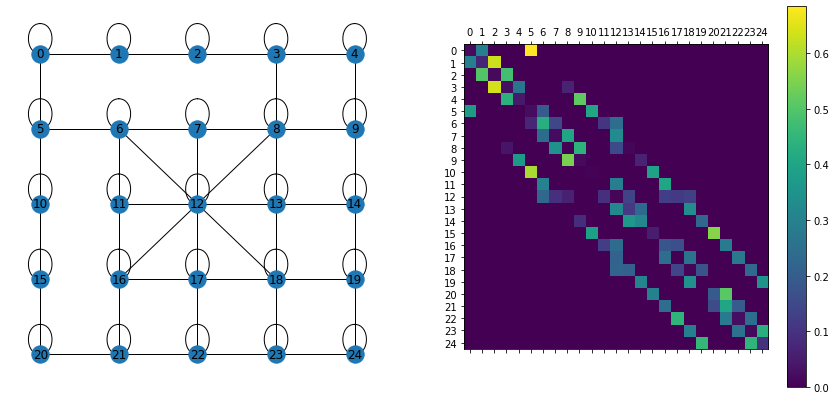


as we saw in problem statement, for each state with high proobability we see a specific observation (number of sensors) and with a small probability wee see less emission. we investigate this condition on learned emission probabilities:


```python
fig, axs = plt.subplots(5, 5, figsize=(30, 30))
fig.suptitle('Emission Probabilities', fontsize=16)
for i in range(n_states):
    axs[i//5][i%5].bar(np.arange(n_obs), emit_probs[i])
    axs[i//5][i%5].set_title('Emission Probs at State {}'.format(i))
    axs[i//5][i%5].set_xlabel('Number of Working Sensors')
```


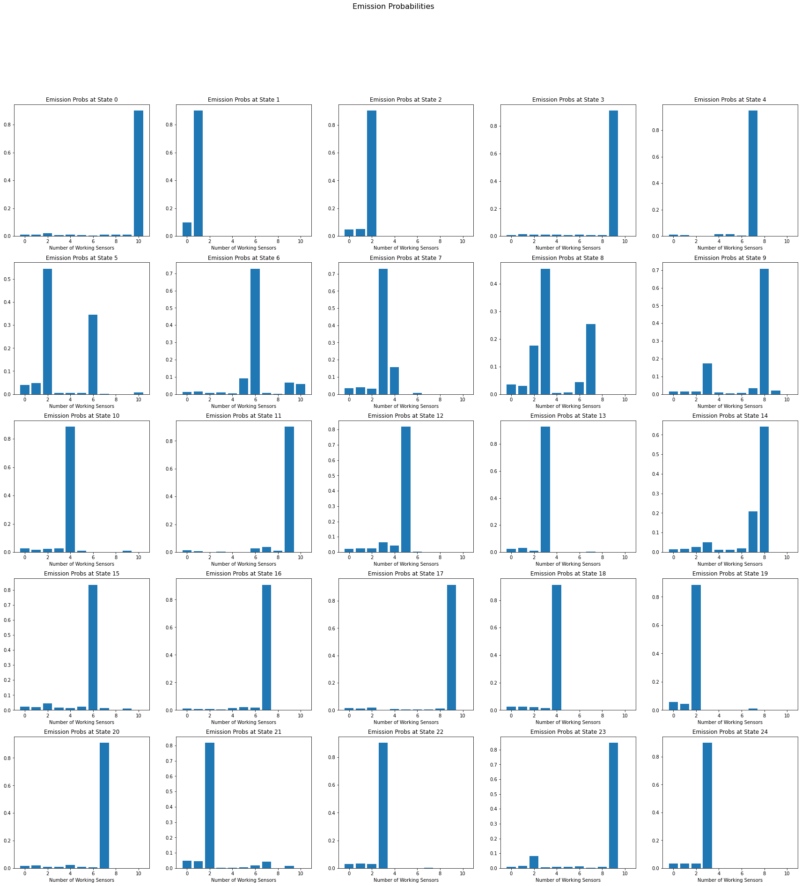


we see that in almost all states, learned emission probabilities match the criteria of problem statement.

now we evaluate likelihoods of some test observations and also decode them using viterbi


```python
model = HMM(25, 11, implementation="scale").init_params(pi, trans_probs, emit_probs)
test_likelihoods = [model.forward_eval(test_seq)[0] for test_seq in test_data]
test_probs = np.exp(test_likelihoods)
print("Test Probabilities: ", test_probs)
np.save('test_likelihoods.npy', test_likelihoods)
np.save('test_probabilities.npy', test_probs)
```

    Test Probabilities:  [2.97720720e-39 6.34119788e-41 1.15052196e-39 1.97656768e-40
     1.46304131e-31 7.72231904e-38 6.79623548e-36 7.51330521e-33
     1.05430686e-40 2.12931646e-42 1.45531078e-35 7.15943210e-41
     2.26773853e-34 1.04825913e-37 9.89746481e-38 4.80207327e-39
     3.40460492e-42 9.38597633e-39 4.27157560e-32 9.93172939e-42
     4.69833729e-41 4.23052278e-35 5.21494122e-38 2.90005220e-42
     1.72987649e-39 1.08327643e-41 5.49080281e-38 7.31786734e-39
     5.08970401e-35 1.42653791e-39 3.38888910e-49 2.42036701e-34
     3.61193534e-38 1.72495774e-30 4.37233407e-41 2.37634131e-34
     4.72346358e-39 1.66169406e-35 7.00252166e-41 1.05192967e-41
     9.12032628e-40 3.15073461e-34 3.43676705e-36 2.17485957e-35
     2.45901739e-36 1.46796242e-34 1.15586155e-35 1.51825282e-30
     4.47050087e-40 2.48349505e-38 2.16229522e-43 4.23318450e-39
     6.45751088e-42 3.89411373e-36 7.38665862e-35 3.35262075e-39
     1.20237469e-33 3.07298536e-43 1.22727912e-32 1.90998026e-37
     1.43513101e-33 1.84060769e-40 2.40394782e-35 1.43628950e-42
     7.19092257e-35 2.05372783e-39 1.25846300e-37 3.03623335e-39
     1.70765558e-40 1.26142119e-35 3.20132279e-38 8.90484355e-40
     3.66139072e-34 1.50996604e-39 1.19254011e-39 5.39625782e-40
     6.45344567e-42 2.97347519e-37 5.25314836e-36 3.68192012e-33
     7.58739080e-43 2.72977988e-38 4.07006025e-42 1.56298151e-37
     6.40051188e-33 3.22870630e-37 1.48374275e-36 4.15497522e-29
     1.01949774e-38 2.26995186e-48 9.90717570e-36 5.63763868e-36
     9.55133937e-38 5.79884441e-41 4.57830465e-39 5.70680349e-44
     1.83637258e-36 5.73598730e-38 1.68341218e-41 1.24937344e-35]


```python
decoded_test_sequences = np.array([ model.decode_viterbi(test_observation) for test_observation in test_data ])
np.save('decode_results.npy', decoded_test_sequences)
decoded_test_sequences
```


    array([[17, 16, 12, ...,  9,  4,  3],
           [17, 22, 17, ...,  6,  6, 12],
           [16, 17, 12, ..., 13, 18, 13],
           ...,
           [ 9,  4,  9, ..., 10, 15, 20],
           [22, 17, 22, ...,  7, 12,  6],
           [10, 15, 10, ..., 10, 15, 10]])


### Markov Chain Stationary Distribution

As part of the definition of a Markov chain, there is some probability distribution on the states at time 0. Each time step the distribution on states evolves - some states may become more likely and others less likely and this is dictated by transition probabilities T. The stationary distribution of a Markov chain describes the distribution of $X_t$ after a sufficiently long time that the distribution of $X_t$ does not change any longer. To put this notion in equation form, let $\pi$ be a column vector of probabilities on the states that a Markov chain can visit. Then, $\pi$ is the stationary distribution if it has the property:
$$ \pi T = \pi $$

Every irreducible finite state space Markov chain has a unique stationary distribution. Recall that the stationary distribution $\pi$ is the row vector such that:

$$ \Rightarrow \pi T - \pi = 0 \Rightarrow \pi (T-I) = 0 \Rightarrow (T-I)^T \pi^T = 0 $$

One challenge though is that we need the constrained solution which respects that $\pi$ describes a probability distribution (i.e. $\sum \pi_{i} = 1$). Luckily this is a linear constraint that is easily represented by adding another equation to the system. So as a small trick, we need to add a row of all 1’s to our $(T−I)^T$ (call this new matrix A) and a 1 to the last element of the zero vector on the right hand side (call this new vector b). Now we want to solve $A\pi=b$.

Since this linear system has more equations than unknowns, it is an overdetermined system. Overdetermined systems can be solved using a QR decomposition, so we use that here. In brief, QR decomposition of A is $A=QR$ with $Q^TQ=I$ and R an upper triangular matrix. Then if $A\pi=b$ it must be the case that $QR\pi=b$ which implies $R\pi=Q^{T}b$, and this can be solved easily because R is triangular.)


```python
def steady_state_distribution(transition_matrix):
    n_states = transition_matrix.shape[0]
    A = np.vstack([(transition_matrix-np.diag(np.ones(n_states))).T, np.ones(n_states)])
    B = np.zeros(n_states+1)
    B[-1] += 1
    Q, R = np.linalg.qr(A)
    return np.linalg.solve(R,Q.T@B)
```


```python
ss_probs = steady_state_distribution(trans_probs)
plt.bar(np.arange(25),ss_probs, width=0.25)
plt.plot(np.arange(25),ss_probs)
plt.xticks(np.arange(n_states))
plt.rcParams["figure.figsize"] = (15,5)
_ = plt.title('Stationary Distribution of States')
```


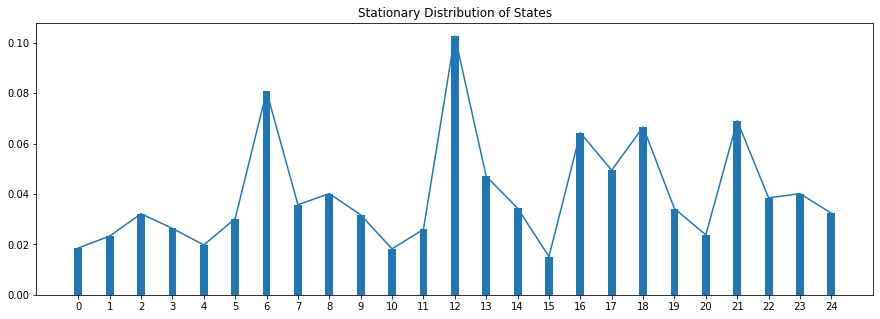


interpretation of steady state distibution for state $S_i$ is that in long run by following current transition policy ,in what porportion of time police is in state $S_i$.

**An important and interesting question is, if some roads are blocked, what transition policy should the police take so that the ratio of time spent patrolling each neighborhood does not change in the long run?**

# 5. Markov Chain Monte Carlo (MCMC)

In statistics, Markov chain Monte Carlo (MCMC) methods comprise a class of algorithms for sampling from a probability distribution. By constructing a Markov chain that has the desired distribution as its equilibrium distribution, one can obtain a sample of the desired distribution by recording states from the chain. The more steps are included, the more closely the distribution of the sample matches the actual desired distribution. Various algorithms exist for constructing chains, including the Metropolis–Hastings algorithm.

Specifically, MCMC is for performing inference (e.g. estimating a quantity or a density) for probability distributions where independent samples from the distribution cannot be drawn, or cannot be drawn easily. for example in high dimensions, the acceptance rate for Rejection Sampling vanishes to zero. it means that for adding one accepted sample we should sample a very large number from proposal distribution which makes rejection samping very sample inefficient in high dimensions.

in MCMCM instead, samples are drawn from the probability distribution by constructing a Markov Chain, where the next sample that is drawn from the probability distribution is dependent upon the last sample that was drawn. The idea is that the chain will settle on (find equilibrium) on the desired quantity we are inferring.

Yet, we are still sampling from the target probability distribution with the goal of approximating a desired quantity, so it is appropriate to refer to the resulting collection of samples as a Monte Carlo sample, e.g. extent of samples drawn often forms one long Markov chain.

## 5.1. Metropolis Hastings

Suppose we want to sample from a distribution π, which we will call the “target” distribution. For simplicity we assume that $\pi$ is a one-dimensional distribution on the real line, although it is easy to extend to more than one dimension.

The MH algorithm works by simulating a Markov Chain, whose stationary distribution is $\pi$. This means that, in the long run, the samples from the Markov chain look like the samples from $\pi$. Its main limitation is that, for difficult problems, “in the long run” may mean after a very long time. However, for simple problems the algorithm can work well.

To implement the MH algorithm, the user (you!) must provide a “transition kernel”, Q. A transition kernel is simply a way of moving, randomly, to a new position in space (y say), given a current position (x say). That is, Q is a distribution on y given x, and we will write it Q(y|x). In many applications Q will be a continuous distribution, in which case Q(y|x) will be a density on y, and so ∫Q(y|x)dy=1 (for all x). but Q also could be discrete too. Because of the role Q plays in the MH algorithm (see below), it is also sometimes called the “proposal distribution”

The MH algorithm for sampling from a target distribution π, using transition kernel Q, consists of the following steps:

- Initialize, $X_1=x1$ say.
- For t=1,2,…

        sample y from $Q(y|x_t)$. Think of y as a “proposed” value for $x_{t+1}$.
        Compute
$$ A=min(1,\frac{π(y)Q(x_t|y)}{π(x_t)Q(y|x_t)})$$ .
        A is often called the “acceptance probabilty”.
        with probability A “accept” the proposed value, and set $x_{t+1}=y$. Otherwise set $x_{t+1}=x_t$.

to answer to proposed question of **"if some roads are blocked, what transition policy should the police take so that the ratio of time spent patrolling each neighborhood does not change in the long run?"**, we use MH algorithm as following.
we have stationary distribution of trained hmm model on initiall city map. now that some streets are blocked, we want to design a transition matrix for new markov chain graph so that its steady state distribution be the same. this is exactly what MH does: we have the target distribution $\pi$ which is ss distribution of first map that we want to reproduce and proposal distribution is new map. by sampling from new map and using MH we get a sequence which its long-run ss distribution is $\pi$. after sampling we can determine transition probability of new markov chain using monte carlo estimation on big sample gained during MH. as we know MH generate a sequence of transitions that belongs to a markov chain with ss equal to target distribution. when we have sequence of samples, by monte carlo estimate for each pair of states $i$ & $j$:

$$ T_{ij} = \frac{\text{Expected  # of time transitioning from state i to j}}{\text{Expected # time being in state i}} = \frac{\sum_{t=1}^{N_{MH-1}} I(Sample_{MH}[t]=i , Sample_{MH}[t+1]=j) }{\sum_{t=1}^{N_{MH}}I(Sample_{MH}[t]=i)} $$

### 5.2. Burn In

Burn-in is intended to give the Markov Chain time to reach its equilibrium distribution, particularly if it has started from a lousy starting point. To "burn in" a chain, you just discard the first 𝑛 samples before you start collecting points.

The idea is that a "bad" starting point may over-sample regions that are actually very low probability under the equilibrium distribution before it settles into the equilibrium distribution. If you throw those points away, then the points which should be unlikely will be suitably rare.

## 5.3. Results


```python
new_city_map = city_map.copy()
with open('./removed_edges.txt', 'r') as removed_edges:
    for edge in removed_edges.readlines():
        u, v = (int(n) for n in edge.split())
        new_city_map[u][v]=0
        new_city_map[v][u]=0
fix, (ax1, ax2) = plt.subplots(1,2, figsize=(15,5))
draw_trans_graph(city_map,ax=ax1)
draw_trans_graph(new_city_map,ax=ax2)
```


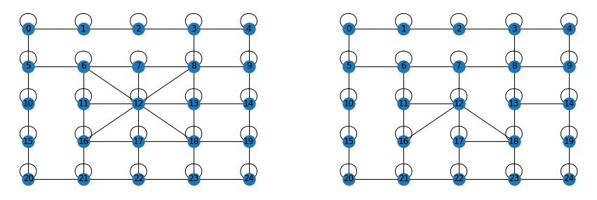


```python
def metropolis(target, proposal, n_samples, burn_in_ratio, hastings=True):
    samples = []
    state = 0
    while len(samples) < n_samples*(1-burn_in_ratio):
        candidate = np.random.choice(np.nonzero(proposal[state])[0])
        q_state_given_given = proposal[candidate][state]/np.sum(proposal[candidate]) if hastings else 1
        q_candidate_given_state = proposal[state][candidate]/np.sum(proposal[state]) if hastings else 1
        acceptance_ratio = min(1, (target[candidate]*q_state_given_given)/(target[state]*q_candidate_given_state))
        if np.random.uniform() < acceptance_ratio:
            samples.append(candidate)
            state = candidate
    return samples[int(n_samples*burn_in_ratio):-1]

def generate_new_transitions(target, proposal, n_samples, hastings):
    samples = metropolis(target=target, proposal=proposal, n_samples=n_samples, burn_in_ratio=0.15, hastings=hastings)
    new_trans_probs = np.array([[0 for j in range(n_states)] for i in range(n_states)])
    for i in range(len(samples)-1):
        new_trans_probs[samples[i]][samples[i+1]] += 1
    new_trans_probs = new_trans_probs / np.sum(new_trans_probs, axis=1).reshape(-1,1)
    new_ss_probs = steady_state_distribution(new_trans_probs)
    return samples, new_trans_probs, new_ss_probs
```


```python
mh_samples, mh_T, mh_ss = generate_new_transitions(target=ss_probs, proposal=new_city_map, n_samples=1e7, hastings=True)
np.save('metropolis_hasting_transitions.npy', mh_T)
```


```python
fig , (ax1, ax2) = plt.subplots(1,2,figsize=(15,7))
im = ax2.matshow(mh_T)
fig.colorbar(im)
ax2.set_xticks(np.arange(25))
_ = ax2.set_yticks(np.arange(25))
draw_trans_graph(new_city_map, ax=ax1)
```


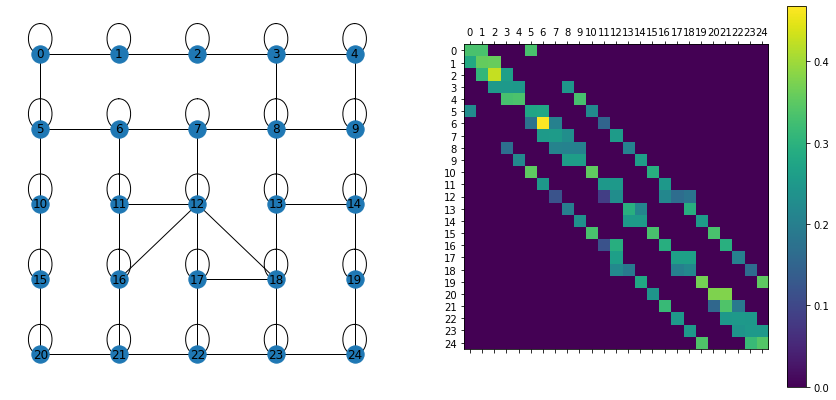


```python
plt.bar(np.arange(n_states),mh_ss, width=0.25, label='SS with Transition Probs Estimated by Metropolis Hastings')
plt.plot(np.arange(n_states),ss_probs, label='Initial SS Distribution')
plt.rcParams["figure.figsize"] = (15,5)
plt.xticks(np.arange(n_states))
_ = plt.legend()
```


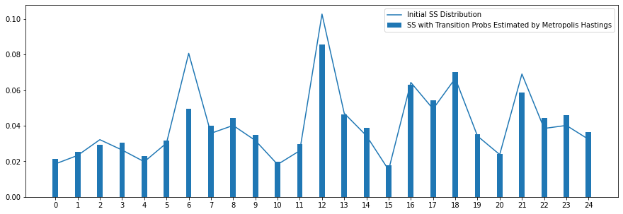


as shown in plot, the new transition probabilites have almost same statioinary distribution as with the initial transitions.

## 5.4. Metropolis Algorithm

Notice that the example random walk proposal Q given above satisfies Q(y|x)=Q(x|y) for all x,y. Any proposal that satisfies this is called “symmetric”. When Q is symmetric the formula for A in the MH algorithm simplifies to:
$$ A=min(1,\frac{π(y)Q(x_t|y)}{π(x_t)Q(y|x_t)}) = min(1,\frac{π(y)}{π(x_t)})$$

This special case of the algorithm, with Q symmetric, was first presented by Metropolis et al, 1953, and for this reason it is sometimes called the “Metropolis algorithm”.

In 1970 Hastings presented the more general version – now known as the MH algorithm – which allows that Q may be assymmetric. Specifically Hastings modified the acceptance probability by introducing the term $Q(x_t|y)/Q(y|x_t)$. This ratio is sometimes called the “Hastings ratio”

**as we saw in stationarry distribution plots, some states are visited less frequently than others in long run. this is a vulnurability in case of safety and criminals plan to attack places which have lower frequency of poice visit. as a solution the police has offered that in a new policy, for each two states A and B, police moves with equal probability of $min(q(A|B),q(B|A))$ between them (self loop probabilites increases obviously). we want to investigate efficieny of this new policy.**

for new policy to be efficient, the ideal result is uniform steady state distribution on states which mean all states are visited equaly in long run. if we use new policy it means that we want to reproduce a uniform target with a symmetric transition matrix so we use metropolis algorithm. then we compare results with reproducing a uniform target with an unconstrained assymetric transition matrix using metropolis hasting algorithm.


```python
new_target = np.ones(n_states)/n_states #uniform

_, metropolis_T_uniform, metropolis_ss_uniform = generate_new_transitions(target=new_target, proposal=city_map, n_samples=1e7, hastings=False)
plt.bar(np.arange(n_states),metropolis_ss_uniform, width=0.25, label='SS with Transition Probs Estimated by Metropolis')
plt.plot(np.arange(n_states),new_target, label='Targeted Uniform SS Distribution')
plt.rcParams["figure.figsize"] = (15,5)
plt.xticks(np.arange(n_states))
_ = plt.legend()
```


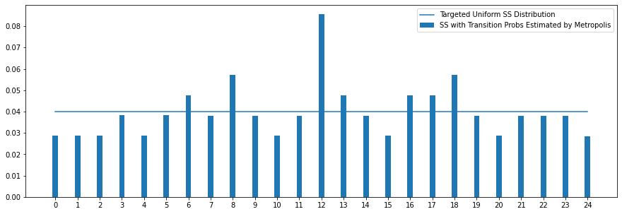


```python
_, mh_T_uniform, mh_ss_uniform = generate_new_transitions(target=new_target, proposal=city_map, n_samples=1e7, hastings=True)
plt.bar(np.arange(n_states),mh_ss_uniform, width=0.25, label='SS with Transition Probs Estimated by Metropolis Hasting')
plt.plot(np.arange(n_states),new_target, label='Targeted Uniform SS Distribution')
plt.rcParams["figure.figsize"] = (15,5)
plt.xticks(np.arange(n_states))
_ = plt.legend()
```


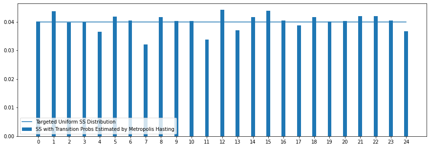


```python
x = np.arange(25)
plt.plot(x,new_target)
plt.bar(x-0.2, ss_probs, width=0.2, color='#ffe74c')
plt.bar(x, metropolis_ss_uniform, width=0.2, color='#ff5964')
plt.bar(x+0.2, mh_ss_uniform, width=0.2, color='#38618c')
plt.xticks(x)
plt.xlabel("States")
plt.ylabel("Stationary Prob")
plt.legend(["Uniform", "Initial SS", "Metropolis SS", "Metropolis Hastings SS"])
plt.show()
```


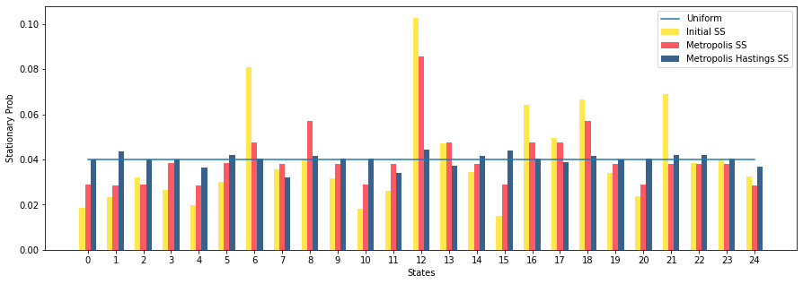


as we see using symmetric transition probs were partly succefull as minimum of statinary probs has increased a good amount(1.5x higher by increasing from 0.02 to 0.03) and no state suffers from very low visit in long run and safety issues. bu as we see using an asymmetric transition prob for a uniform target is way more succesfull and it has reached almost uniform visitations which is great. the reason is unbalancy in number of streets connected to each state. when some states have high streets connected to them and some other have a few, by enforcing equal and symmetric transition between states, for low degree states the weight of edges connected to high degree states doesnt increase because this probability was $min(q(A|B),q(B|A))$ and due to high number of edges of high degree state min is dominated by big state and also its prob is probably very small for the small state. so in small state the probability of self loops increase too much which means probability of staying in that state in next step increases which is good for safety. but for high degree states the ss prob decreases as it has too many edges and with current strategy probability of self loops decreases in this states. thiis procedure leads to a balance in stationary probs between states. but using metropolis hastings without constraining on being symmetric the probability values are adjusted in a way that almost unifrom ss probs has been achived.


but in cities with big number of neighbourhoods, the symmetric transition strategies has a problem. as we saw in small degree states probability of edges connected to high degree states is determined by high degree states and this causes probability of self loops to increase. when number of neighbourhoods is high the weights of high degree city is very small beause max degree is high and weights should sum to 1. so the probability of self loops in low degree states may converge to 1 sometimes. this means that new strategy may create absorbing states in markov chain model which causes the police tho trap in a state and never exit which is a security disaster for other states and city!

# References

<a href="https://ieeexplore.ieee.org/document/18626">[1]</a> Lawrence R. Rabiner, ‘ A Tutorial on Hidden Markov Models and Selected Applications in Speech Recognition', Proceedings of the IEEE, Vol. 77, No. 2, pp.257-286, February, 1989
<br><a href="https://en.wikipedia.org/w/index.php?title=Baum%E2%80%93Welch_algorithm&oldid=1066299093">[2]</a> Wikipedia contributors. "Baum–Welch algorithm." Wikipedia, The Free Encyclopedia. Wikipedia, The Free Encyclopedia, 17 Jan. 2022. Web. 4 Feb. 2022
<br><a href="https://www.stat.umn.edu/geyer/f05/8931/n1998.pdf">[3]</a> J. Geyer. 'Markov Chain Monte Carlo Lecture Notes Charles'
